Serverless Computing using Azure Functions  
Nov. 2023

<br />

### Contents

- [Exercise 6: SFTP サポートを有効にしたストレージ アカウントの作成](#exercise-6-sftp-サポートを有効にしたストレージ-アカウントの作成)

- [Exercise 7: 関数アプリの作成と展開](#exercise-7-関数アプリの作成と展開)

- [Exercise 8: SQL Database のテーブル作成とファイアウォール設定](#exercise-8-sql-database-のテーブル作成とファイアウォール設定)

- [Exercise 9: イベント サブスクリプションの作成](#exercise-9-イベント-サブスクリプションの作成)

<br />

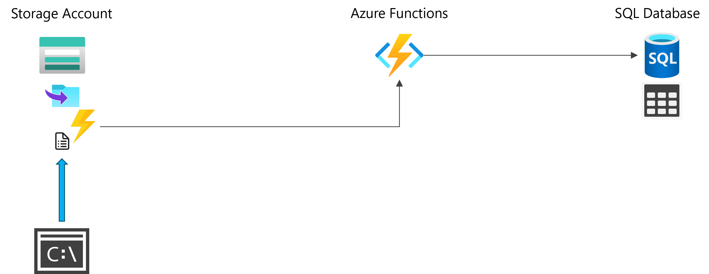

## Exercise 6: SFTP サポートを有効にしたストレージ アカウントの作成

### Task 1: ストレージ アカウントの作成

- Azure ポータルのトップ画面から **＋ リソースの作成** をクリック

  

- **カテゴリ** で **ストレージ** を選択し、**ストレージ アカウント** の **作成** をクリック

  

- ストレージ アカウントを作成する

  - **基本**

    - **プロジェクトの詳細**

      - **サブスクリプション**: ワークショップで使用中のサブスクリプション

      - **リソース グループ**: ワークショップで使用中のリソース グループ

    - **インスタンスの詳細**

      - **ストレージ アカウント名**: 任意

      - **地域**: リソース グループと同じ地域を選択

      - **パフォーマンス**: Standard

      - **冗長性**: ローカル冗長ストレージ (LRS)

      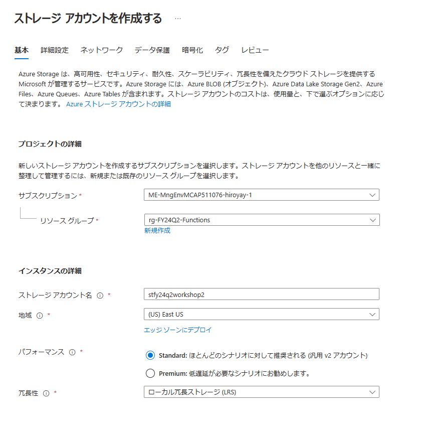

  - **詳細設定**

    - **階層型名前空間**

      - **階層型名前空間を有効にする**: オン

    - **アクセス プロトコル**

      - **SFTP を有効にする**: オン

      ※ 他の項目は既定の設定

      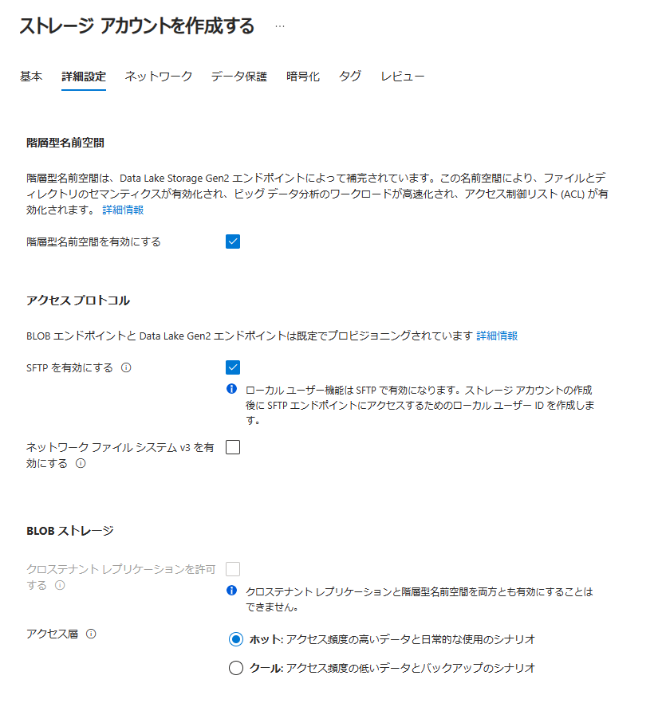

  - **レビュー** をクリック

  - 指定した内容を確認し、**作成** をクリック

    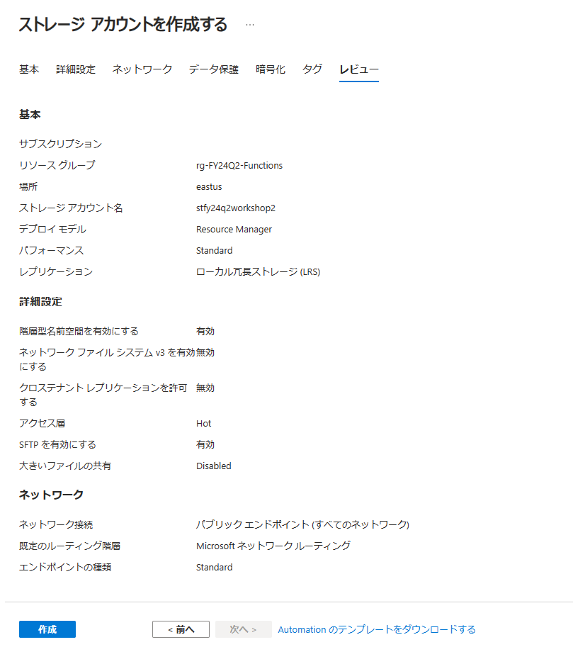

<br />

### Task 2: 権限の構成

- 新しく作成したストレージ アカウントの管理ブレードへ移動

- **SFTP** を選択、**＋ ローカル ユーザーを追加する** をクリック

  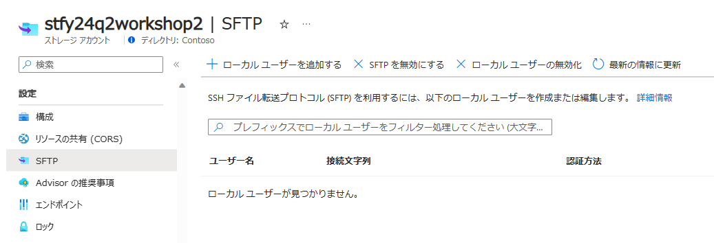

- ローカル ユーザーを追加する

  - **ユーザー名＋認証**

    - **ユーザー名**: sftpuser (任意)

    - **認証方法**

      - **SSH パスワード**: オン

    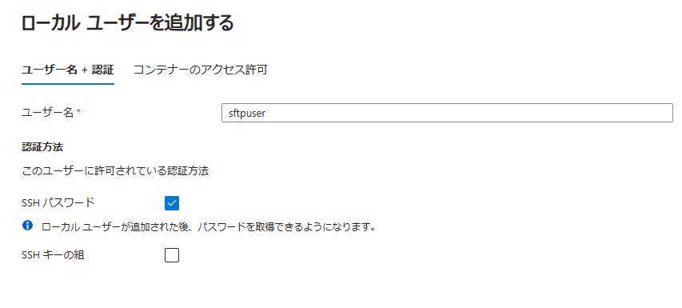

  - コンテナーの **新規作成** をクリックし、コンテナーを作成

    - **名前**: contents (任意、3 ～ 63 文字、英子文字、数字、ハイフンのみ)

    - **匿名アクセス レベル**: プライベート (匿名アクセスはありません)

      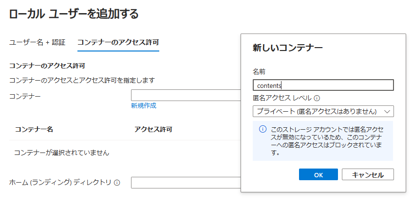

  - **コンテナーのアクセス許可**

    - **コンテナー**: 新規作成したコンテナー

    - **アクセス許可**: すべてのアクセス許可

    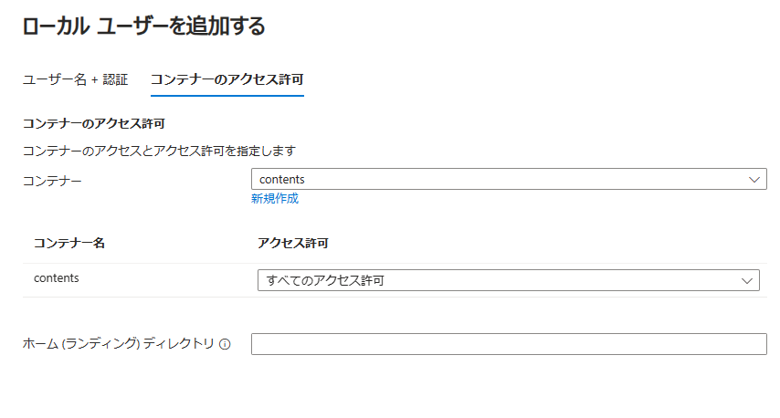

  - **追加** をクリック

- SSH パスワードが表示、コピーしてメモ帳などのテキストに貼り付け

  ※ この機会でのみパスワードが取得可のため注意

- ローカル ユーザーが追加

  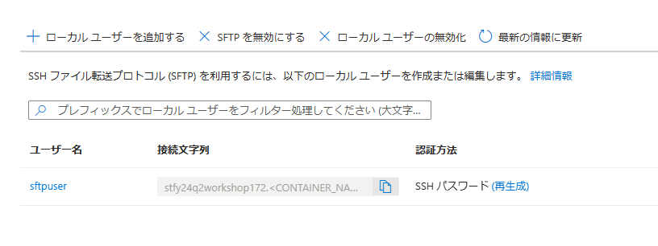

<br />

## Exercise 7: 関数アプリの作成と展開

### Task 1: 関数アプリの作成

- Azure ポータルのトップ画面から **＋ リソースの作成** をクリック

  

- **関数アプリ** の **作成** をクリック

  

- 関数アプリの作成

  <details>
    <summary>C#</summary>

  - **基本**

    - **プロジェクトの詳細**

      - **サブスクリプション**: ワークショップで使用するサブスクリプション

      - **リソース グループ**: ワークショップで使用するリソース グループ

    - **インスタンスの詳細**

      - **関数アプリ名**: 任意の名前 (2 ～ 60 文字、英数字、およびハイフンのみ)

      - **コードまたはコンテナー**: コード

      - **ランタイム スタック**: .NET

      - **バージョン**: 7 (STS) Isolated

      - **地域**: リソース グループと同じ地域を選択

    - **オペレーティング システム**

      - **オペレーティング システム**: Windows

    - **ホスティング**

      - **ホスティング オプションとプラン**: 消費量 (サーバーレス)

      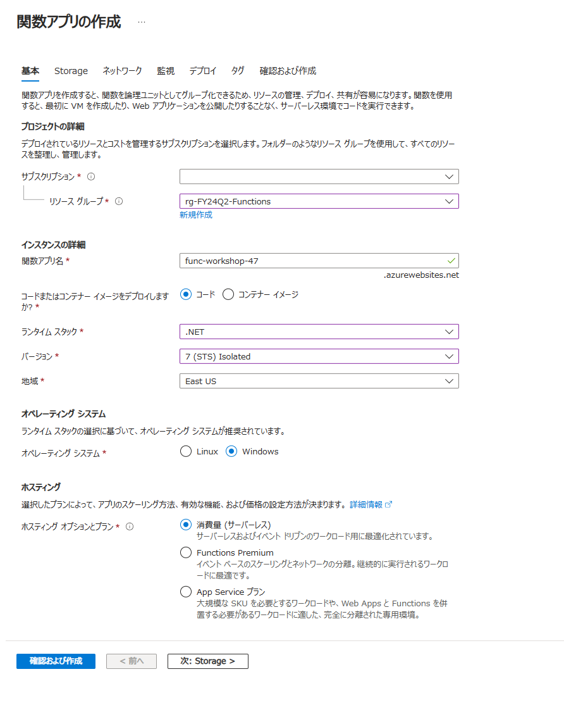

  - **Storage**

    - **ストレージ アカウント**: (新規)xxx (名前を変更する場合は新規作成をクリックして入力、英子文字、数字で 3 ～ 24 文字)

      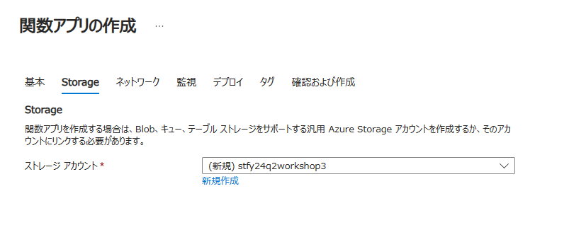

  - **ネットワーク**

    - **パブリック アクセスを有効にする**: オン

    - **ネットワーク インジェクションを有効にする**: オフ

      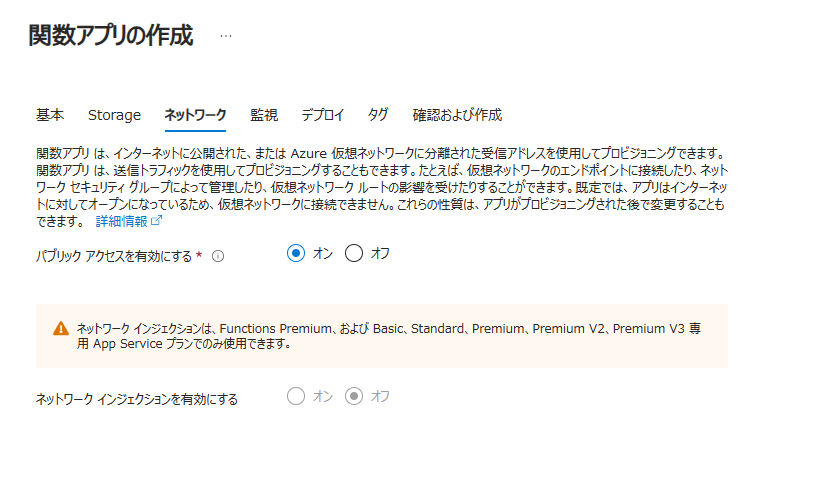

  - **監視**

    - **Application Insights を有効にする**: いいえ

      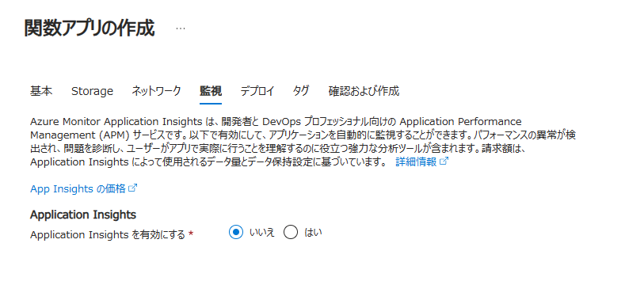

  - **デプロイ**

    - **継続的デプロイ**: 無効化

      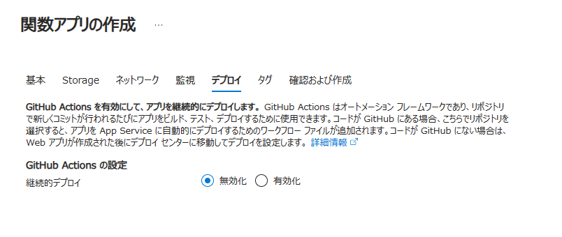

  - **確認および作成** をクリック、表示される内容を確認し **作成** をクリック

    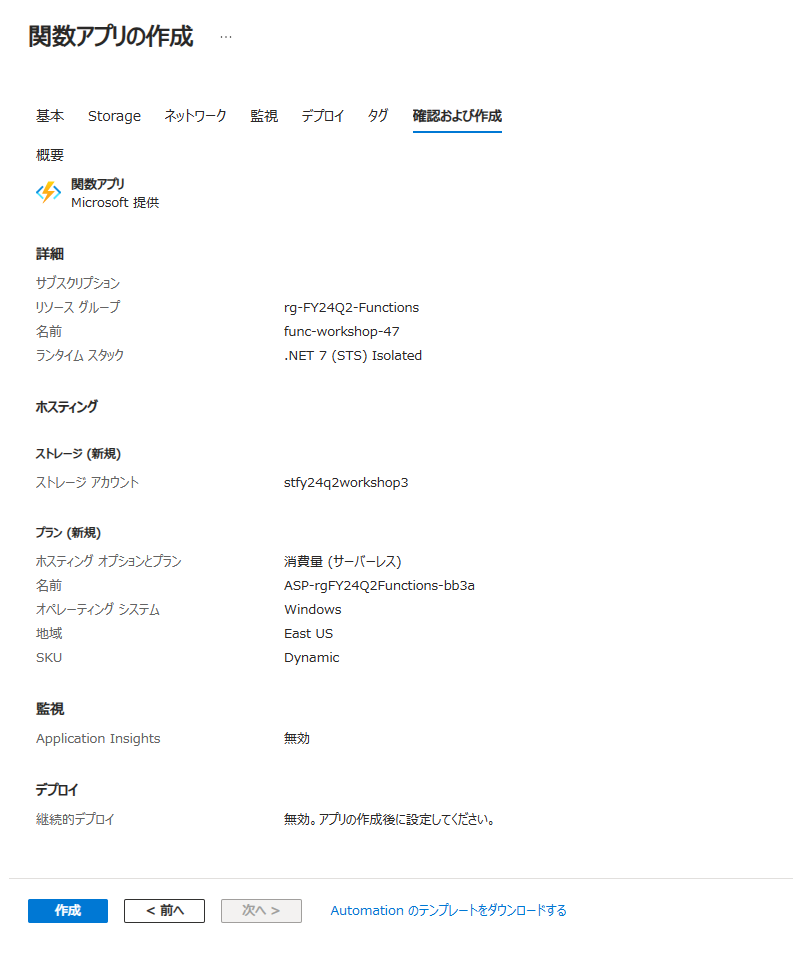

  </details>

  <br />

  <details>
    <summary>Python</summary>

  - **基本**

    - **プロジェクトの詳細**

      - **サブスクリプション**: ワークショップで使用するサブスクリプション

      - **リソース グループ**: ワークショップで使用するリソース グループ

    - **インスタンスの詳細**

      - **関数アプリ名**: 任意の名前 (2 ～ 60 文字、英数字、およびハイフンのみ)

      - **コードまたはコンテナー**: コード

      - **ランタイム スタック**: Python

      - **バージョン**: 3.10

      - **地域**: リソース グループと同じ地域を選択

    - **オペレーティング システム**

      - **オペレーティング システム**: Linux

    - **ホスティング**

      - **ホスティング オプションとプラン**: 消費量 (サーバーレス)

      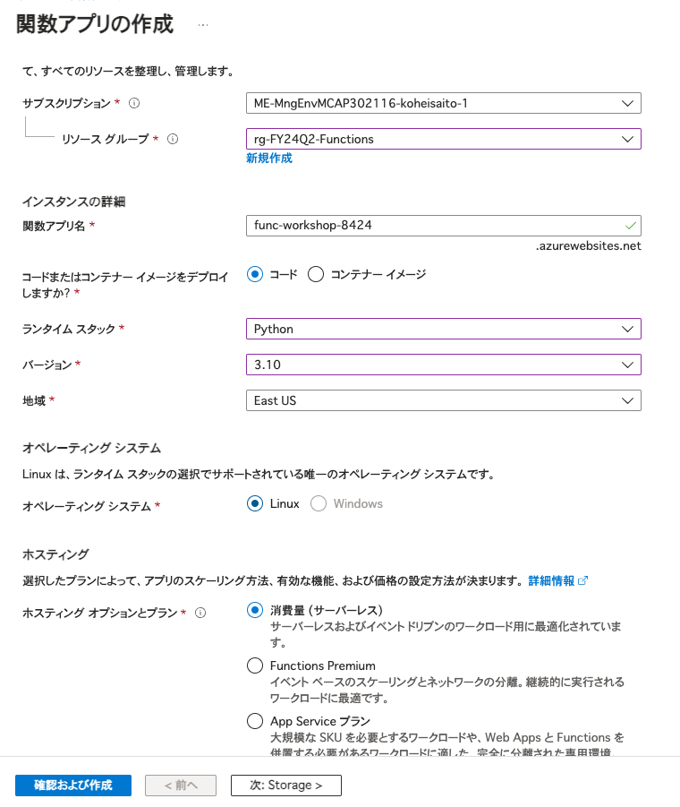

  - **Storage**

    - **ストレージ アカウント**: (新規)xxx (名前を変更する場合は新規作成をクリックして入力、英子文字、数字で 3 ～ 24 文字)

      

  - **ネットワーク**

    - **パブリック アクセスを有効にする**: オン

    - **ネットワーク インジェクションを有効にする**: オフ

      

  - **監視**

    - **Application Insights を有効にする**: いいえ

      

  - **デプロイ**

    - **継続的デプロイ**: 無効化

      

  - **確認および作成** をクリック、表示される内容を確認し **作成** をクリック

    

  </details>

<br />

### Task 2: Visual Studio Code からのデプロイ

- **Terminal** - **New Terminal** を選択し、ターミナルを表示

- プロジェクト ファイルのディレクトリへ移動

  <details>
    <summary>C#</summary>

  ```
  cd src/CS/Api2
  ```

  </details>

  <br />

  <details>
    <summary>Python</summary>

  ```
  cd src/Python/Api2
  ```

  </details>

  <br />

- func azure functionapp publish コマンドでプロジェクト ファイルをデプロイ

  ```
  func azure functionapp publish <作成した関数アプリ名>
  ```

  ※ Python の場合は、最後に --python を付与して実行

- デプロイが正常に終了したことを確認

  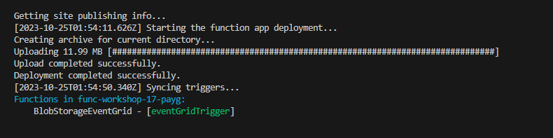

<br />

### Task 3: 関数アプリの構成

- Azure Functions の管理ブレードへ移動

- **構成** メニューを選択、**＋ 新しいアプリケーション設定** をクリック

  

- アプリケーション設定の追加/編集画面で、追加する構成の名前、値を入力し **OK** をクリック

  <details>
  <summary>C#</summary>

  - **名前**: CosmosConnectionString

  - **値**: Cosmos DB への接続文字列 (リソースグループにある Cosmos DB アカウントを開き、左のメニューの設定の下にあるキーのページから**プライマリ接続文字列**の値をコピーして貼り付け)

  </details>

  <br />
  
  <details>
  <summary>Python</summary>

  - **名前**: SqlConnectionString

  - **値**: SQL Database への接続文字列

    

  </details>

- **保存** をクリック

  

- **変更の保存** の確認メッセージが表示されるので **続行** をクリック

<br />

## Exercise 8: SQL Database のファイアウォール設定とテーブル作成  (Python 版では実施不要)

### Task 1: ファイアウォールの設定

- **概要** を選択し、**サーバー ファイアウォールの設定** をクリック

- **例外** の **Azure サービスおよびリソースにこのサーバーへのアクセスを許可する** にチェックを付け、 **保存**　をクリック

  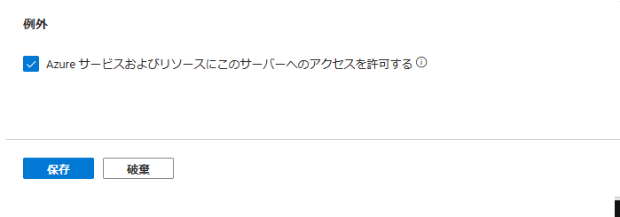

<br />

### Task 2: テーブルの作成

- SQL Database (AdventureWorksLT) の管理ブレードを表示

- **クエリ エディター (プレビュー)** を選択

- パスワードを入力し **OK** をクリック

  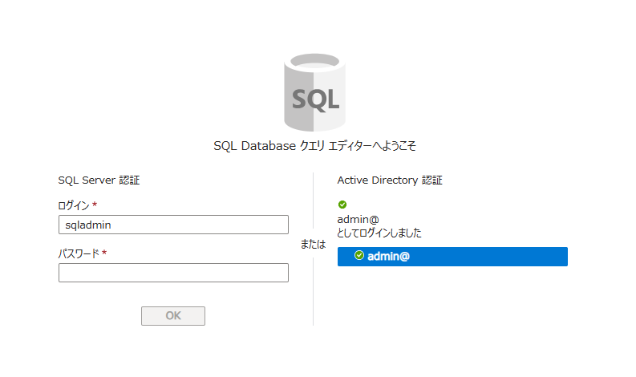

- クエリを入力し **実行** をクリック

  ```
  CREATE TABLE dbo.WorkItem (
  	[Id] UNIQUEIDENTIFIER PRIMARY KEY,
  	[ContentName] NVARCHAR(50),
  	[ContentLength] INT,
  	[BlobUrl] NVARCHAR(200)
  );
  ```

- クエリが成功しましたのメッセージが表示され、テーブルが追加されたことを確認

  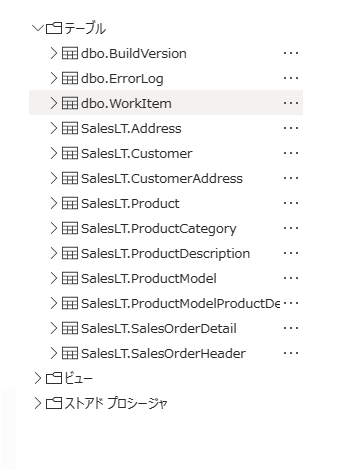

<br />

## Exercise 9: イベント サブスクリプションの作成

### Task 1: イベント サブスクリプションの作成

- ストレージ アカウントの管理ブレードへ移動、**イベント** を選択し、**＋ イベント サブスクリプション** をクリック

  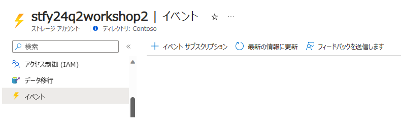

- イベント サブスクリプションの作成

  - **基本**

    - **イベント サブスクリプションの詳細**

      - **名前**: 任意 (3 ～ 64 文字、英数字、ハイフンのみ)

      - **イベント スキーマ**: イベント グリッド スキーマ

    - **トピックの詳細**

      - **トピックの種類**: ストレージ アカウント

      - **ソース リソース**: ストレージ アカウント名

      - **システム トピック名**: 任意 (3 ～ 128 文字、英数字、ハイフンのみ)

    - **イベントの種類**

      - **イベントの種類のフィルター**: Blob Created

    - **エンドポイントの詳細**

      - **エンドポイントのタイプ**: Azure 関数

      - **エンドポイント**: エンドポイントの構成をクリックし関数を選択

        

- **作成** をクリック (**フィルター**、**追加の機能**、**配信プロパティ**、**詳細エディター** の設定は既定のまま) (Python 版では、トリガーは eventGridTrigger)

  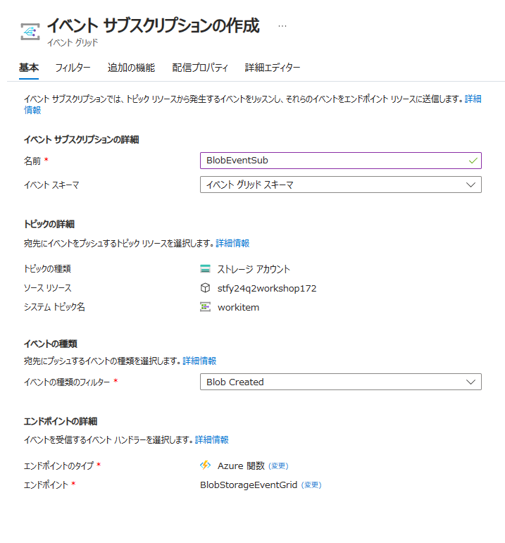

- イベント サブスクリプションが正常に作成されたことを確認

  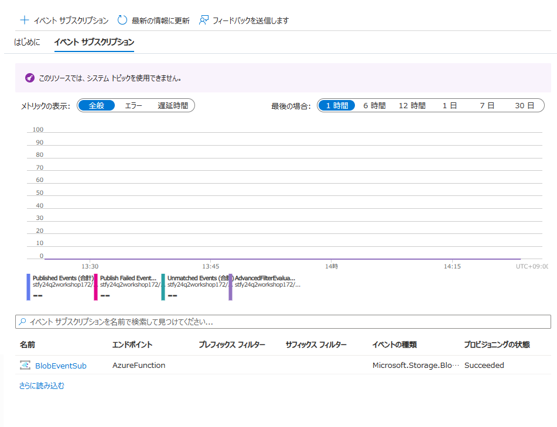

<br />

### Task 2: SFTP によるファイル転送

- コマンド プロンプトを起動

- SFTP 接続

  ```
  sftp {ストレージ アカウント名}.{コンテナー名}.sftpuser@{ストレージ アカウント名}.blob.core.windows.net
  ```

  ※ {ストレージ アカウント名} を作成したストレージ アカウント名へ変更

  ※ {コンテナー名} をローカル ユーザー作成時に作成したコンテナー名へ変更

- パスワード入力が求められるので、ローカル ユーザー作成時に表示されたパスワードを入力

- **put** コマンドで任意のファイルを転送

  ```
  put 任意のファイル名
  ```

  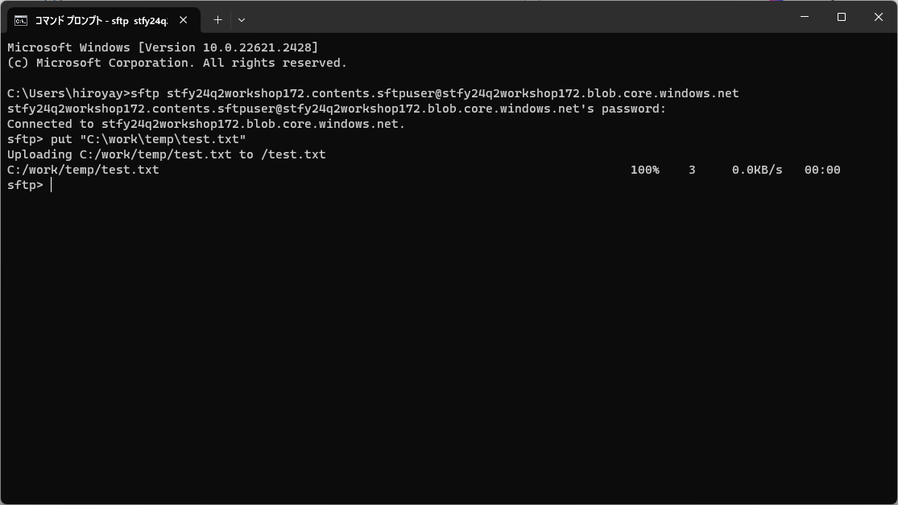

<br />

<details>
  <summary>C#</summary>

- SQL Database (AdventureWorksLT) の管理ブレードを表示

- **クエリ エディター (プレビュー)** を選択

- クエリを記述し **実行** をクリック

  ```
  select * from [dbo].[WorkItem]
  ```

- SFTP で転送されたファイルの情報が登録されていることを確認

  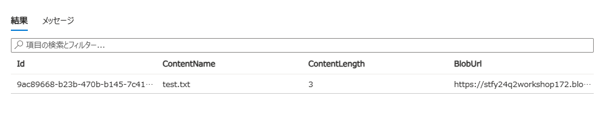

</details>

<br />

<details>
  <summary>Python</symmary>
  
  - Cosmos DB の管理ブレードを表示
  - **データエクスプローラー** を選択
  - **items** > **events** > **Items** を選択
  - SFTP で転送されたファイルの情報が登録されていることを確認

  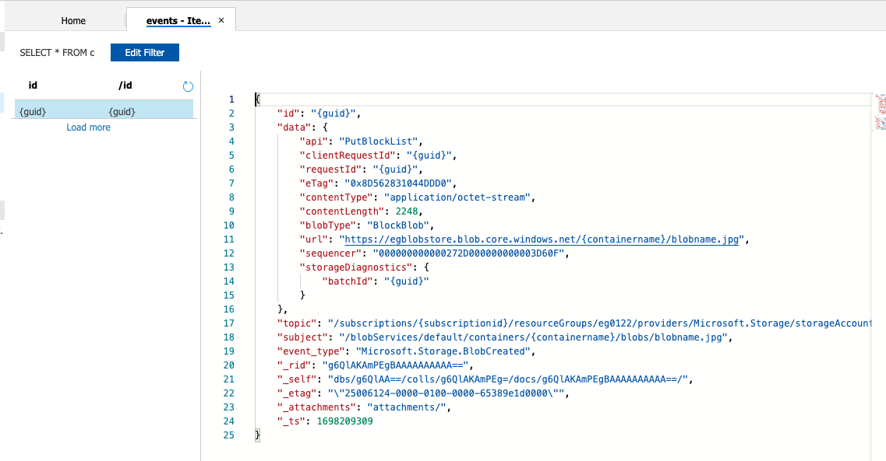

</details>
