Serverless Computing using Azure Functions   
Nov. 2023

<br />

### Contents

- [環境準備](#環境準備)

- [Exercise 1: 関数アプリの作成と展開](#exercise-1-関数アプリの作成と展開)

- [Exercise 2: 関数アプリの保護](#exercise-2-関数アプリの保護)

- [Exercise 3: Key Vault 参照の利用](#exercise-3-key-vault-参照の利用)

- [Exercise 4: API Management による API の公開](#exercise-4-api-management-による-api-の公開)

- [Exercise 5: API のバージョン管理](#exercise-5-api-のバージョン管理)

<br />

## 環境準備

### SQL Server の設定

- [Azure ポータル](#https://portal.azure.com)へアクセス

- 事前展開済みの SQL Server の管理ブレードへ移動し、**ネットワーク** を選択

- **ファイアウォール規則** の **＋クライアント IPv4 アドレス (xxx.xxx.xxx.xxx) の追加** をクリック

  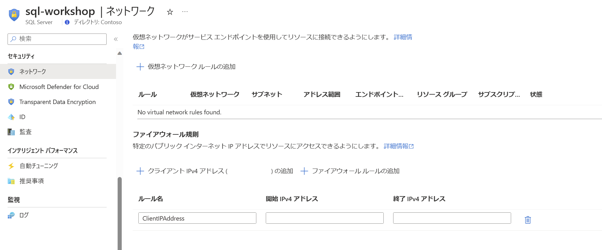

- **保存** をクリック

<br />

### 仮想マシンへの接続

- 事前展開済みの仮想マシンの管理ブレードへ移動し、"**接続**" - "**Bastion**" を選択

  

- ユーザー名、パスワードを指定し、仮想マシンへ接続

  

- 新しいタブで仮想マシンへの接続を行い、デスクトップ画面が表示

<br />

### Task 1: リポジトリのフォーク

- Web ブラウザを起動し、[ワークショップのリポジトリ](#https://github.com/hiroyay-ms/Serverless-Computing-using-Azure-Functions)へ移動

- 画面右上の **Fork** をクリック

  

- 自身のアカウントにリポジトリが複製されていることを確認

<br />

### Task 2: Git の初期構成

- Visual Studio Code を起動 (デスクトップ上の準備されたショートカットをダブルクリック)

- **Terminal** - **New Terminal** を選択し、ターミナルを表示

  

- Git の初期設定を実行

  - ユーザー名の設定

    ```
    git config --global user.name "User Name"
    ```

    ※ User Name を自身の名前に変更

  - Email アドレスの設定

    ```
    git config --global user.email "Email@Address"
    ```

    ※ {Email Address} を使用するメール アドレスに変更

  - 設定値の確認

    ```
    git config --list --global
    ```

    ※ 設定したユーザー名・メール アドレスが出力されたら OK

<br />

### Task 3: 開発環境へのリポジトリのクローン

- Web ブラウザで Fork したリポジトリの **Code** をクリック

  表示されるツール チップよりリポジトリの URL をコピー

  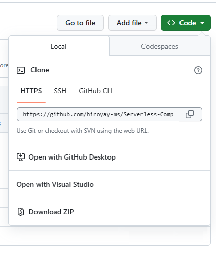

- Visual Studio Code のサイドバーから Explorer を選択し **Clone Repository** をクリック

  

- リポジトリの URL の入力を求められるためコピーした URL を貼り付け Enter キーを押下

  

- 複製先となるローカル ディレクトリ (Documents) を選択

  GitHub の認証情報が求められる場合は、アカウント名、パスワードを入力し認証を実施

- 複製されたリポジトリを開くかどうかのメッセージが表示されるので **Open** をクリック

- Explorer に複製したリポジトリのディレクトリ、ファイルが表示

  ```
  git remote -v
  ```

  - クローン先の GitHub URL が出力されたら OK

    - <自分のアカウント名>/Serverless-Computing-using-Azure-Functions になっていることを確認

    - (hiroyay-ms/Serverless-Computing-using-Azure-Functions になっていないことを確認)

    <br />

## Exercise 1: 関数アプリの作成と展開

### Task 1: 関数アプリの作成

- Azure ポータルのトップ画面から **＋ リソースの作成** をクリック

  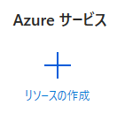

- **関数アプリ** の **作成** をクリック

  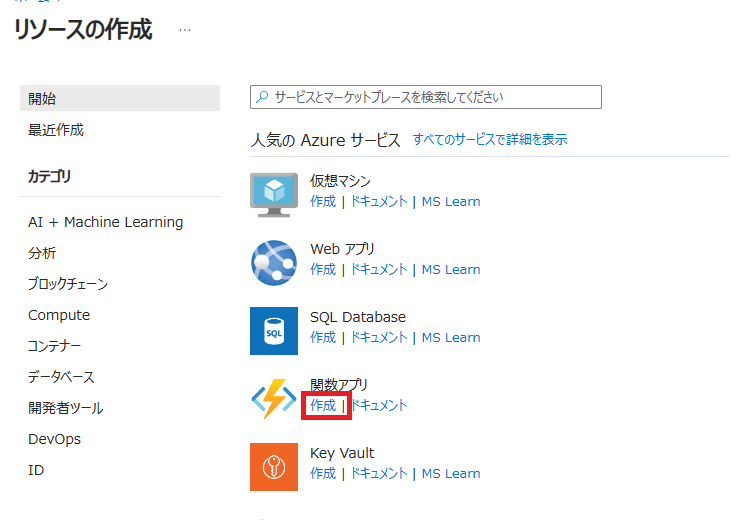

- 関数アプリの作成

  <details>
    <summary>C#</summary>
    
    - **基本**

      - **プロジェクトの詳細**

        - **サブスクリプション**: ワークショップで使用するサブスクリプション

        - **リソース グループ**: ワークショップで使用するリソース グループ

      - **インスタンスの詳細**

        - **関数アプリ名**: 任意の名前 (2 ～ 60 文字、英数字、およびハイフンのみ)

        - **コードまたはコンテナー**: コード

        - **ランタイム スタック**: .NET

        - **バージョン**: 7 (STS) Isolated

        - **地域**: リソース グループと同じ地域を選択

      - **オペレーティング システム**

        - **オペレーティング システム**: Windows

      - **ホスティング**

        - **ホスティング オプションとプラン**: Functions Premium

        - **Windows プラン**: 任意 (既定の名前を変更する場合は新規作成をクリックして入力)

        - **価格プラン**: エラスティック Premium EP1 (ACU 合計 210, 3.5 GB メモリ, 1 vCPU)
    
      - **ゾーン冗長**

        - **ゾーン冗長**: 無効

        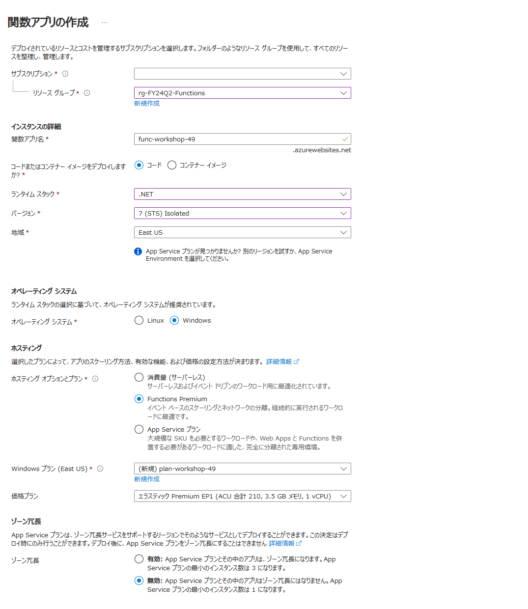

    - **Storage**

      - **ストレージ アカウント**: (新規)xxx (名前を変更する場合は新規作成をクリックして入力、英子文字、数字で 3 ～ 24 文字)

        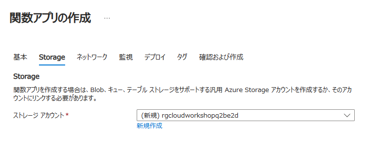
    
    - **ネットワーク**

      - **パブリック アクセスを有効にする**: オン

      - **ネットワーク インジェクションを有効にする**: オフ

        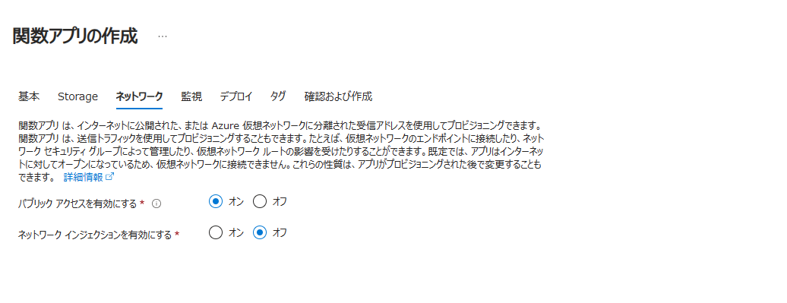

    - **監視**

      - **Application Insights を有効にする**: いいえ

        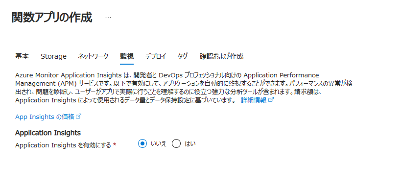

    - **デプロイ**

      - **継続的デプロイ**: 無効化

        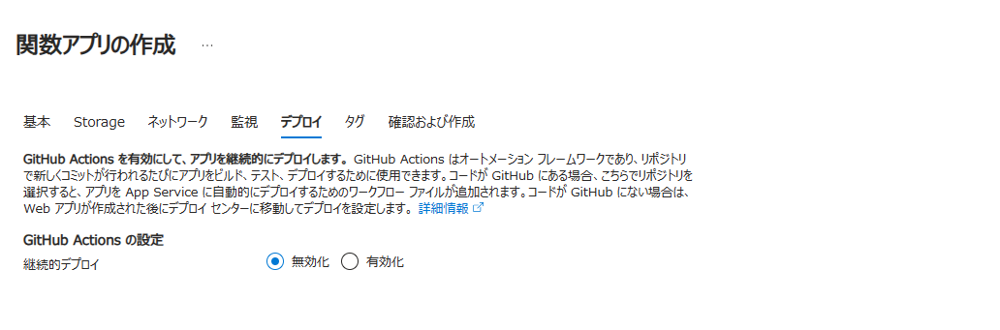
    
    - **確認および作成** をクリック、表示される内容を確認し **作成** をクリック

      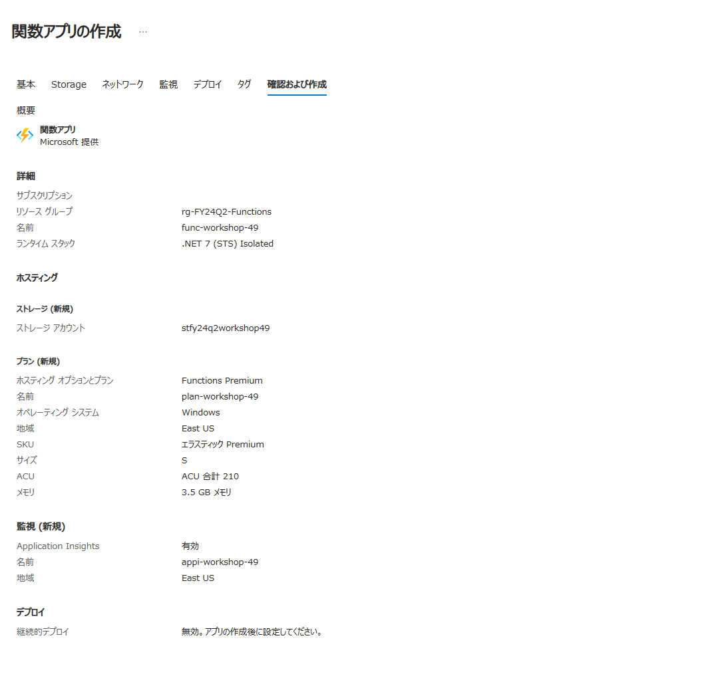

  </details>

  <br />

  <details>
    <summary>Python</summary>
  </details>

<br />

### Task 2: Visual Studio Code からのデプロイ

- **Terminal** - **New Terminal** を選択し、ターミナルを表示

  

- az login コマンドを実行

  ```
  az login
  ```

  Web ブラウザーが起動、サインイン画面が表示されるのでサインインを実行

  ※ サインイン後はブラウザを閉じる

- プロジェクト ファイルのディレクトリへ移動

  <details>
    <summary>C#</summary>

    ```
    cd src/CS/Api1
    ```

  </details>

  <br />

  <details>
    <summary>Python</summary>
  </details>

  <br />

- func azure functionapp publish コマンドでプロジェクト ファイルをデプロイ

  ```
  func azure functionapp publish <作成した関数アプリ名>
  ```

- デプロイが正常に終了したことを確認

  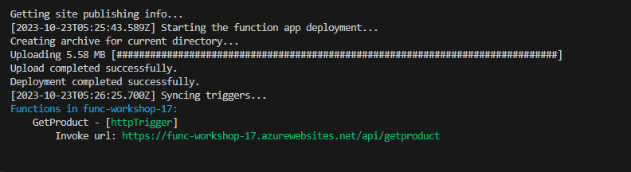

<br />

### Task 3: 関数アプリの構成

- Azure ポータルで SQL Database (AdventureWorksLT) の管理ブレードを表示

- **接続文字列** を選択し **ADO.NET (SQL 認証)** の接続文字列をコピーし、メモ帳などのテキスト エディターに貼り付け

  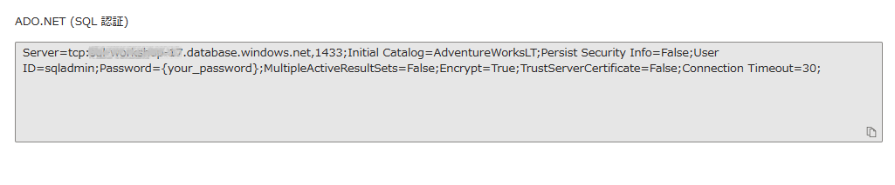

- **{your_password}** を SQL Database への認証で使用するアカウントのパスワードに変更

  ※ 後の手順で使用するためコピー

- Azure Functions の管理ブレードへ移動

- **構成** メニューを選択、**＋ 新しいアプリケーション設定** をクリック

  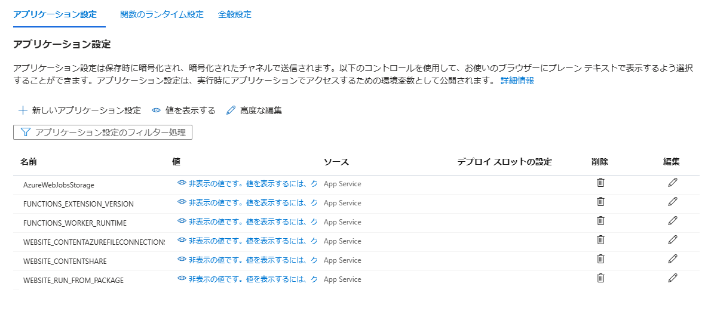

- アプリケーション設定の追加/編集画面で、追加する構成の名前、値を入力し **OK** をクリック

  - **名前**: SqlConnectionString

  - **値**: SQL Database への接続文字列

    

- **保存** をクリック

  

- **変更の保存** の確認メッセージが表示されるので **続行** をクリック

<br />

### Task 4: 関数アプリの実行

- Web ブラウザーを起動、アドレス バーに関数アプリの展開時に出力された URL を貼り付け

- ?id=xx (xx は数字、5, 7, 10, 22, 27, 35 の間で指定) を付与して実行

  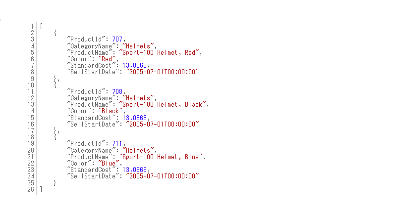

  ※ データベースから取得したレコードを表示

<br />

## Exercise 2: 関数アプリの保護

### Task 1: SQL Database のネットワーク構成

- SQL Database (AdventureWorksLT) の管理ブレードへ移動

- **概要** メニューの画面上部より **サーバー ファイアウォールの設定** をクリック

- **パブリック アクセス** タブで **パブリック ネットワーク アクセス** を **無効化** に設定し **保存** をクリック

  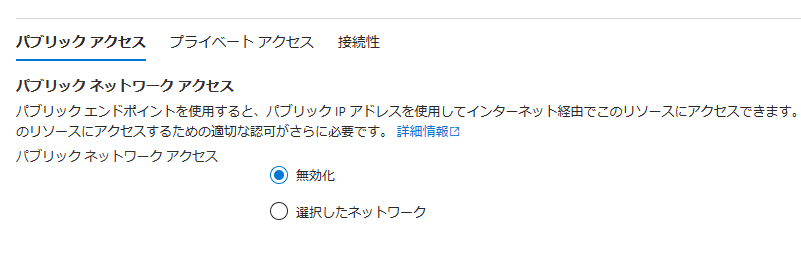

- **プライベート アクセス** タブを選択、**＋ プライベート エンドポイントを作成します** をクリック

  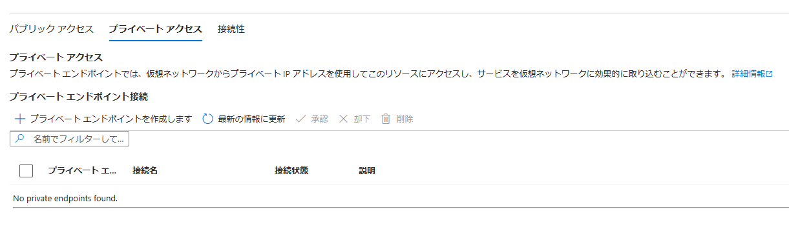

- プライベート エンドポイントを作成する

  - **基本**

    - **プロジェクトの詳細**

      - **サブスクリプション**: ワークショップで使用中のサブスクリプション

      - **リソース グループ**: ワークショップで使用中のリソース グループ

    - **インスタンスの詳細**

      - **名前**: 任意 (2 ～ 64 文字、英数字、ピリオド、アンダースコア、ハイフン)

      - **ネットワーク インターフェイス名**: 任意 (2 ～ 64 文字、英数字、ピリオド、アンダースコア、ハイフンを使用可)

      - **地域**: リソース グループと同じ地域を選択

      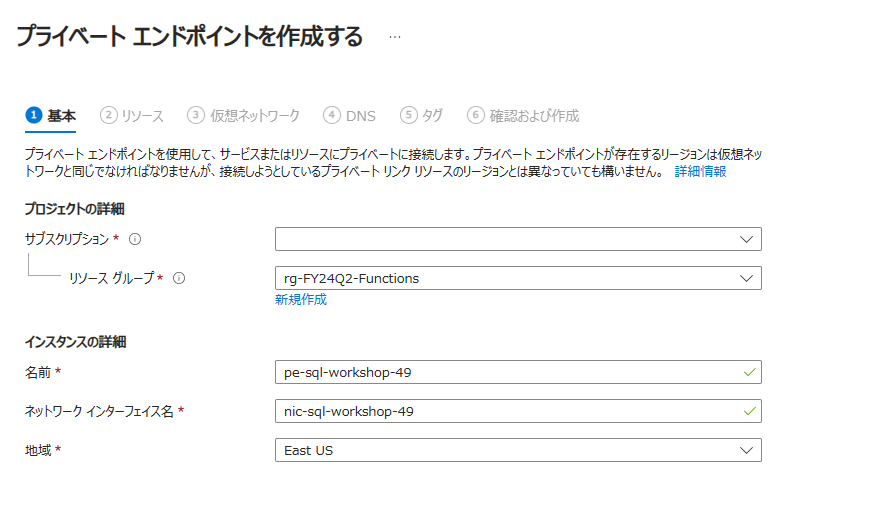

  - **リソース**

    - **対象サブリソース**: sqlServer

      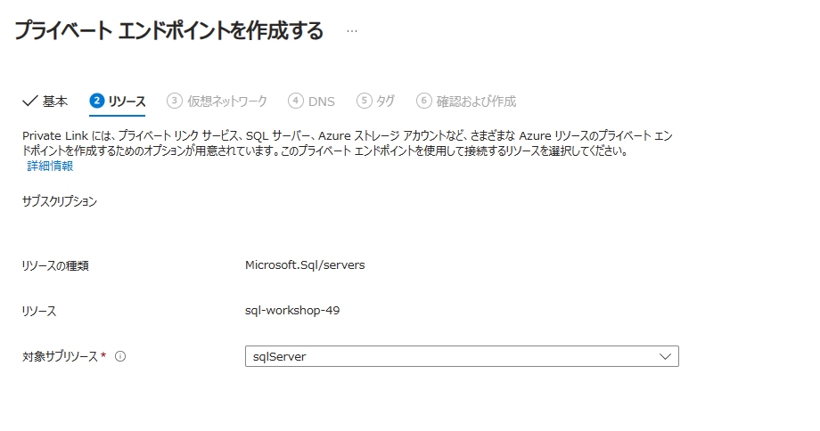

  - **仮想ネットワーク**

    - **ネットワーク**

      - **仮想ネットワーク**: 事前展開済みの仮想ネットワークを選択

      - **サブネット**: Subnet-2 (任意)

      - **プライベート エンドポイントのネットワーク ポリシー**: 無効

    - **プライベート IP 構成**

      - **IP アドレスを動的に割り当てる**: オン

      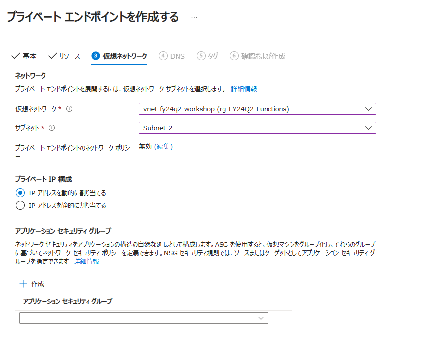

      ※ アプリケーション セキュリティ グループはなし

  - **DNS**

    - **プライベート DNS ゾーンと統合する**: はい

      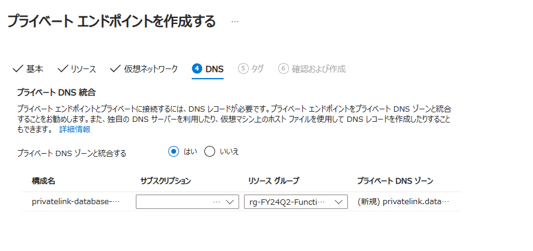

      ※ サブスクリプション、リソース グループはワークショップで使用中のものを選択

  - **タグ**

    - 既定のまま（なし）

      

  - **確認および作成** をクリックし、検証が成功したことを確認し **作成** をクリック

    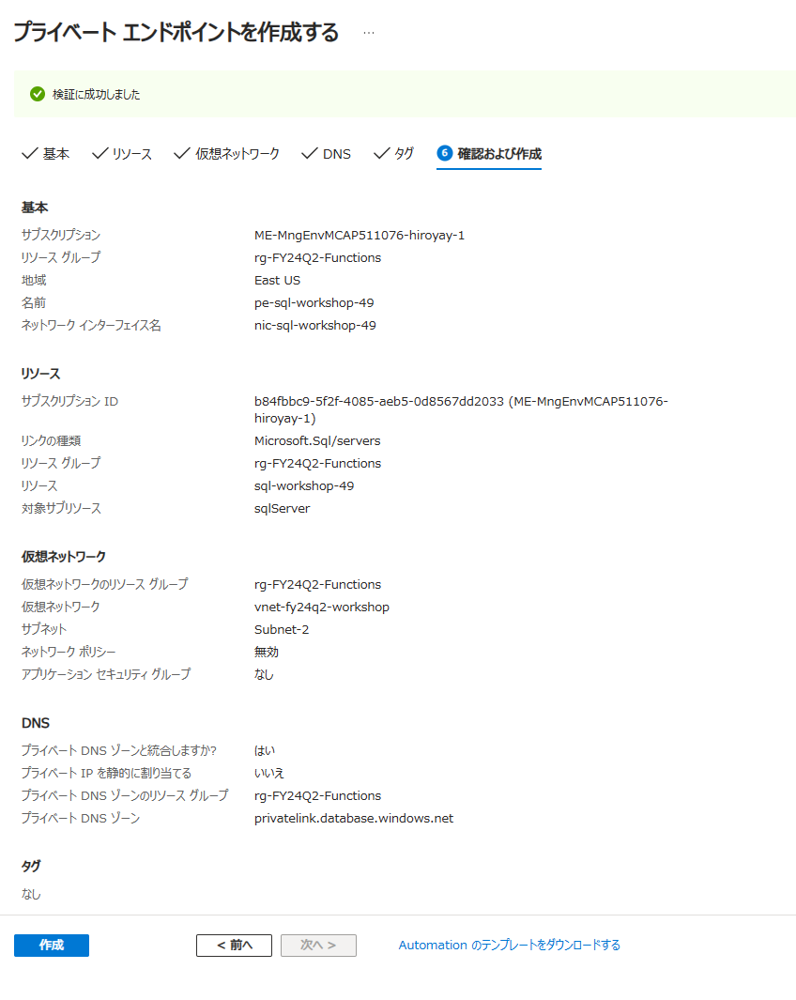

<br />

### Task 2: ストレージ アカウントの作成

- Azure ポータルのトップ画面から **＋ リソースの作成** をクリック

  

- カテゴリで **ストレージ** を選択、ストレージ アカウントの **作成** をクリック

  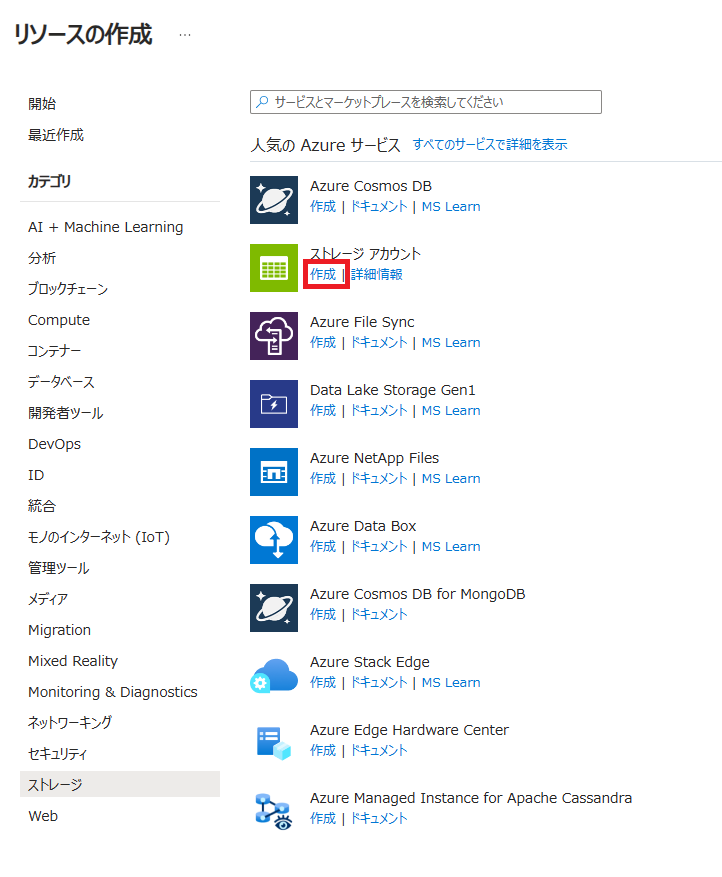

- ストレージ アカウントを作成する

  - **基本**

    - **プロジェクトの詳細**

      - **サブスクリプション**: ワークショップで使用中のサブスクリプション

      - **リソース グループ**: ワークショップで使用中のリソース グループ

    - **インスタンスの詳細**

      - **ストレージ アカウント名**: 任意 (英子文字、数字のみで 3 ～ 24 文字)

      - **地域**: リソース グループと同じ地域を選択

      - **パフォーマンス**: Standard

      - **冗長性**: ローカル冗長ストレージ (LRS)
    
    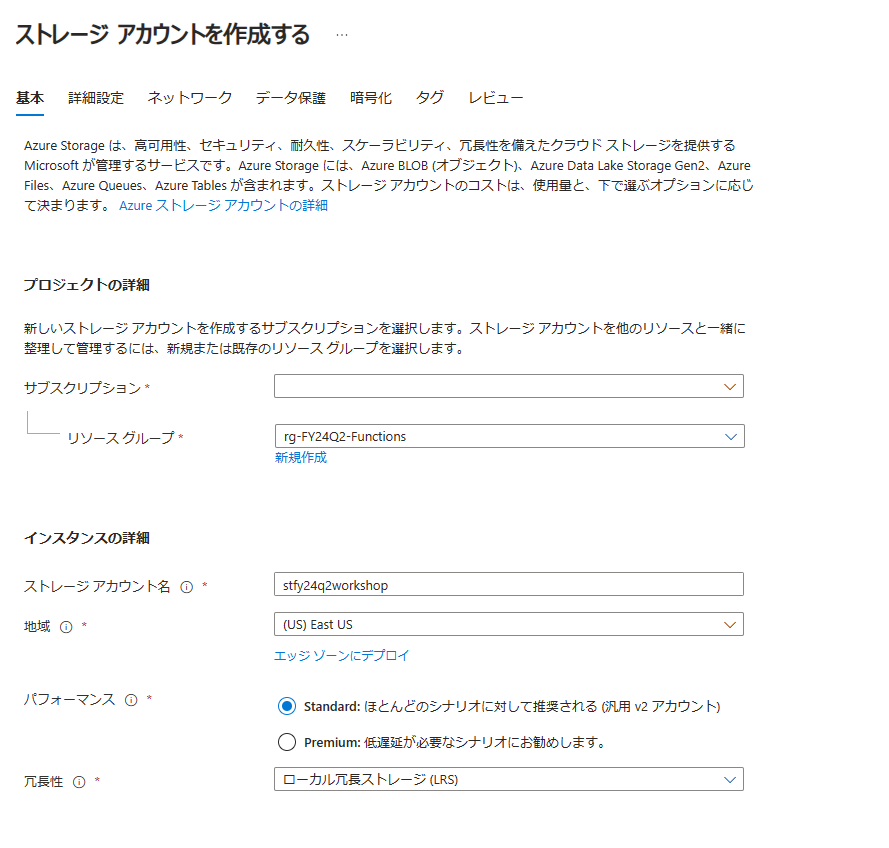

  - **レビュー** をクリック

    ※ 詳細設定、ネットワーク、データ保護、暗号化、タグの設定は既定のまま

  - 指定した内容を確認し **作成** をクリック

    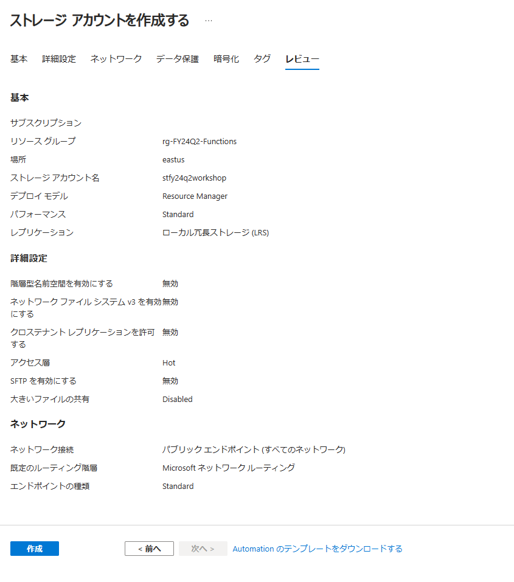

<br />

### Task 3: 既存ストレージ アカウントから新ストレージ アカウントへのコンテンツのコピー

- Azure Functions が使用中のストレージ アカウントの管理ブレードへ移動

- **Shared Access Signature** を選択

- BLOB とファイルのコンテンツを読み取る SAS を生成

  - **使用できるサービス**: BLOB, ファイル

  - **使用できるリソースの種類**: サービス、コンテナー、オブジェクト

  - **与えられているアクセス許可**: 読み取り、リスト

  - **BLOB バージョン管理のアクセス許可**: バージョンの削除を有効にするをオフ

  - **開始日時と有効期限の日時**: 既定

  - **使用できる IP アドレス**: 指定なし (既定)

  - **許可されるプロトコル**: HTTPS のみ (既定)

  - **署名キー**: key1 (既定)

    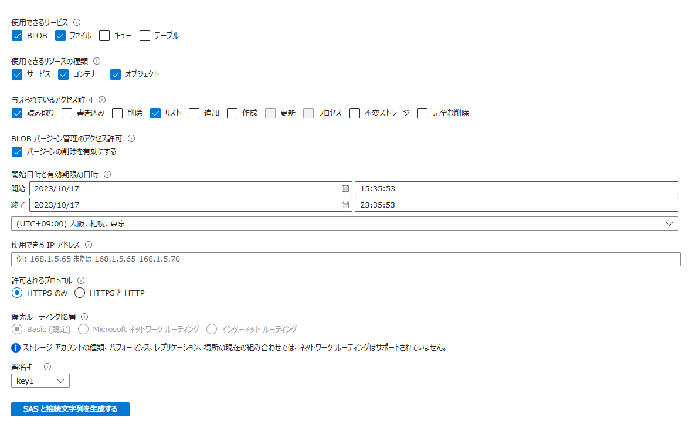

- **SAS と接続文字列を生成する** をクリック、生成された Blob service の SAS URL と File サービスの SAS URL をコピー

  ※ 後の手順で利用できるようメモ帳などのテキスト エディターに貼り付け、コピー元の URL として利用

- 新しく作成したストレージ アカウントの管理ブレードへ移動、**Shared Access Signature** を選択

- BLOB とファイルのコンテンツを書き込む SAS を生成

  - **使用できるサービス**: BLOB, ファイル

  - **使用できるリソースの種類**: サービス、コンテナー、オブジェクト

  - **与えられているアクセス許可**: 読み取り、書き込み、削除、リスト、追加、作成

  - **BLOB バージョン管理のアクセス許可**: バージョンの削除を有効にするをオン (既定)

  - **許可された BLOB インデックスのアクセス許可**: 読み取り/書き込み、フィルターの双方をオン (既定)

  - **開始日時と有効期限の日時**: 既定

  - **使用できる IP アドレス**: 指定なし (既定)

  - **許可されるプロトコル**: HTTPS のみ (既定)

  - **優先ルーティング階層**: Basic (既定)

  - **署名キー**: key1 (既定)

- **SAS と接続文字列を生成する** をクリック、生成された Blob service の SAS URL と File サービスの SAS URL をコピー

  ※ 後の手順で利用できるようメモ帳などのテキスト エディターに貼り付け、コピー先の URL として利用

- azcopy を使用し BLOB コンテンツをコピー

  ```
  azcopy copy 'コピー元の Blob service の SAS URL' 'コピー先の Blob service の SAS URL' --recursive
  ```

  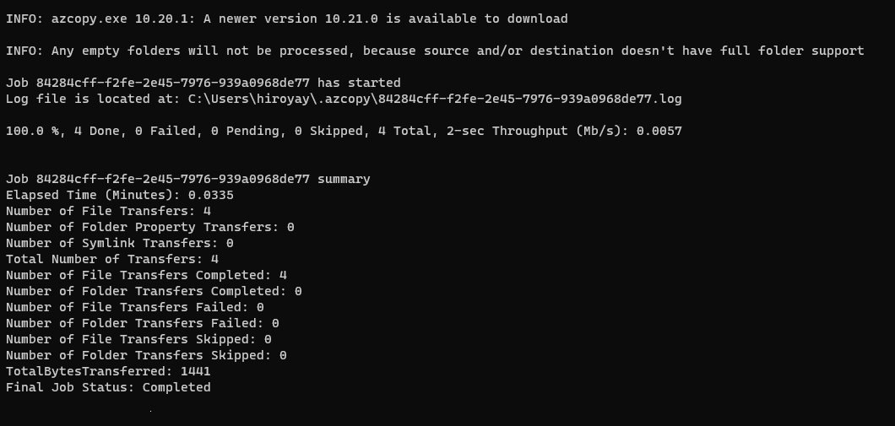

- azcopy を使用し、ファイル コンテンツをコピー

  ```
  azcopy copy 'コピー元の File サービスの SAS URL' 'コピー先の File サービスの SAS URL' --recursive --preserve-smb-permissions=true --preserve-smb-info=true
  ```

  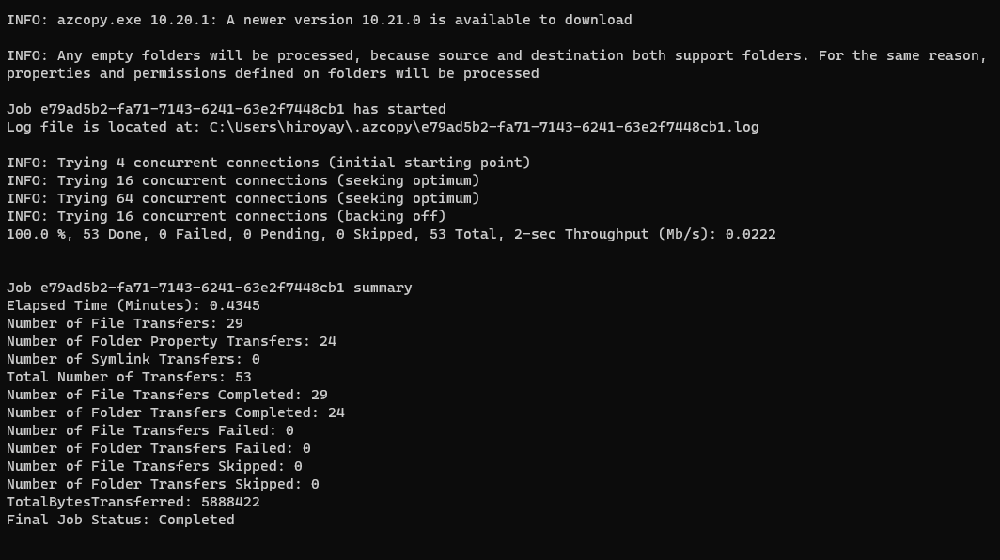

- 新しいストレージ アカウントのコンテナーとファイル共有にコンテンツがコピーされていることを確認

  - **コンテナー**

    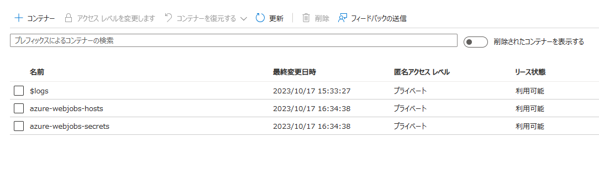

  - **ファイル共有**

    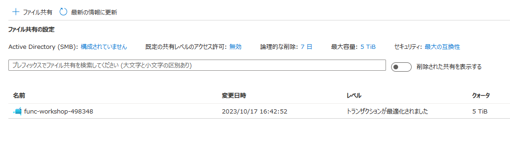

<br />

### Task 4: ストレージ アカウントのネットワーク構成

- 新しいストレージ アカウントの管理ブレードで **ネットワーク** を選択

- **ファイアウォールと仮想ネットワーク** タブで **パブリック ネットワーク アクセス** を **無効** に設定

- **保存** をクリックし、変更内容を適用

  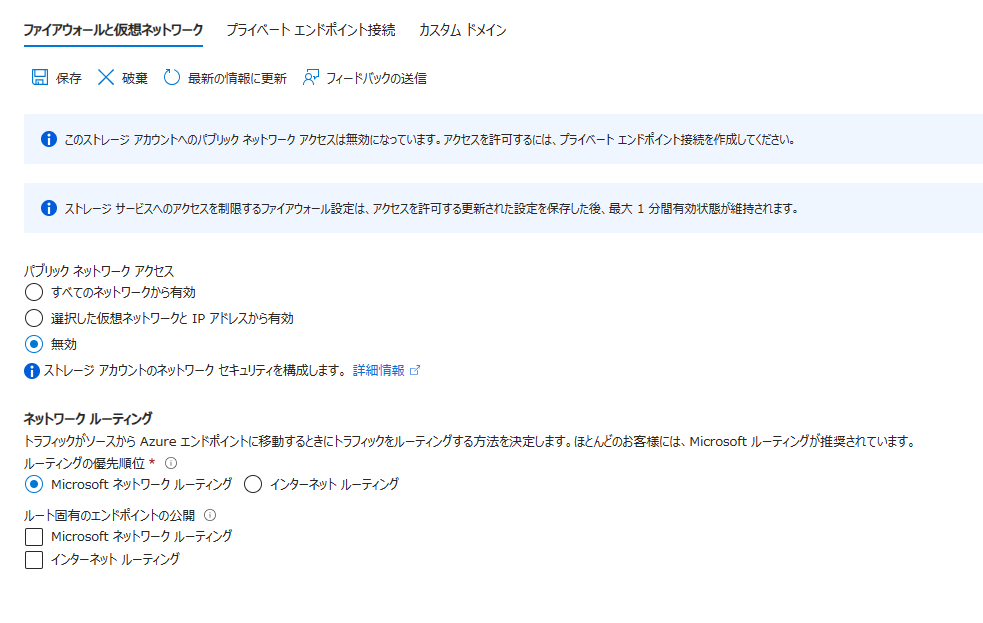

- **プライベート エンドポイント接続** タブを選択、**＋ プライベート エンドポイント** をクリック

  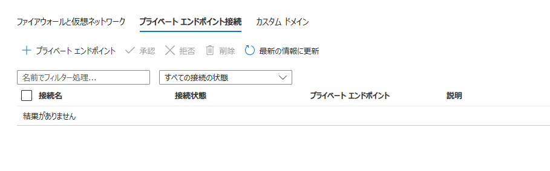

- プライベート エンドポイントを作成する

  - **基本**

    - **プロジェクトの詳細**

      - **サブスクリプション**: ワークショップで使用中のサブスクリプション

      - **リソース グループ**: ワークショップで使用中のリソース グループ

    - **インスタンスの詳細**

      - **名前**: 任意 (2 ～ 64 文字、英数字、ピリオド、アンダースコア、ハイフン)

      - **ネットワーク インターフェイス名**: 任意 (2 ～ 64 文字、英数字、ピリオド、アンダースコア、ハイフンを使用可)

      - **地域**: リソース グループと同じ地域を選択

      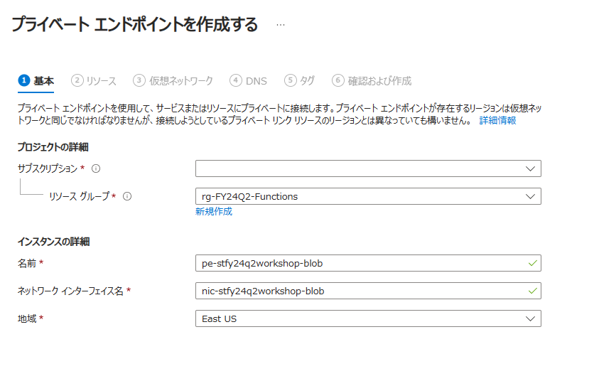

  - **リソース**

    - **対象サブリソース**: blob

      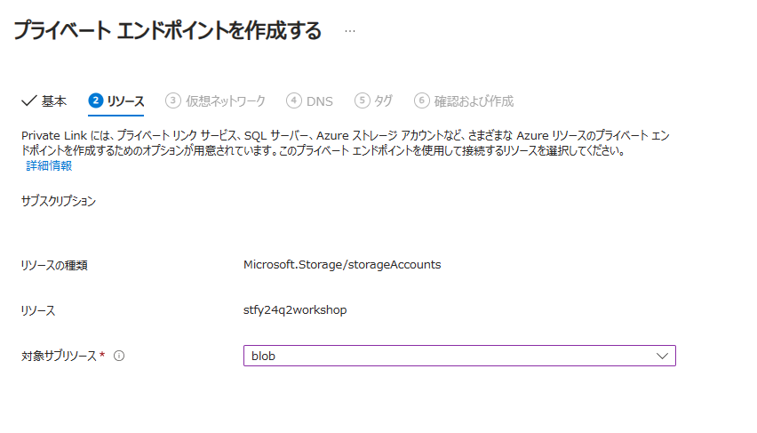

  - **仮想ネットワーク**

    - **ネットワーク**

      - **仮想ネットワーク**: 事前展開済みの仮想ネットワークを選択

      - **サブネット**: Subnet-2 (任意)

      - **プライベート エンドポイントのネットワーク ポリシー**: 無効

    - **プライベート IP 構成**

      - **IP アドレスを動的に割り当てる**: オン

      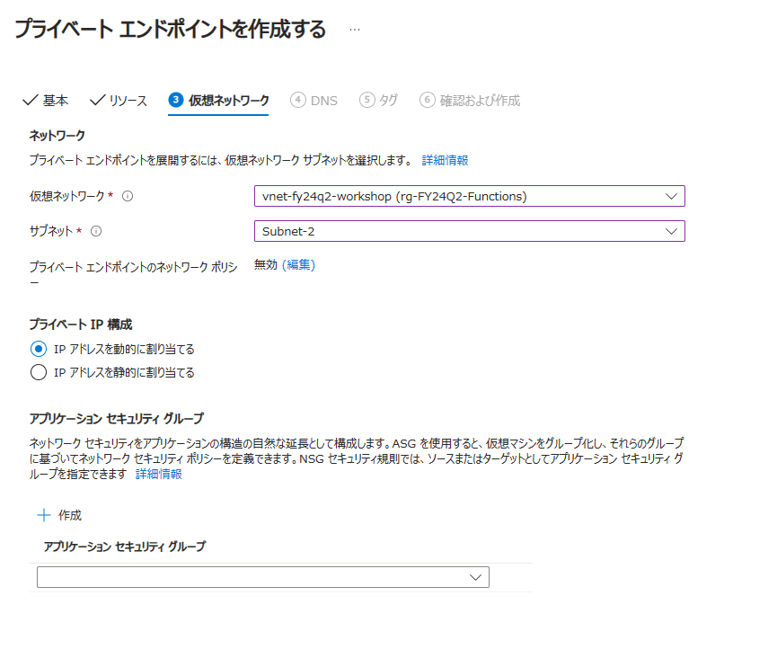

      ※ アプリケーション セキュリティ グループはなし

  - **DNS**

    - **プライベート DNS ゾーンと統合する**: はい

      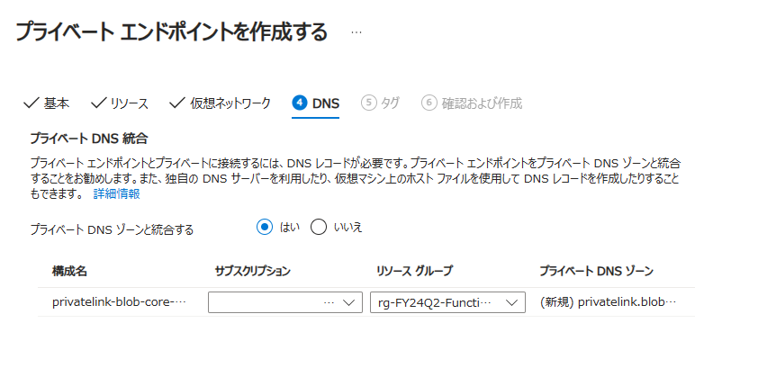

      ※ サブスクリプション、リソース グループはワークショップで使用中のものを選択

  - **タグ**

    - 既定のまま（なし）

      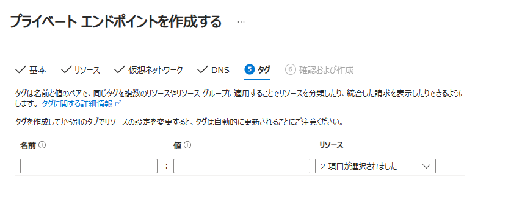

  - **確認および作成** をクリックし、検証が成功したことを確認し **作成** をクリック

    

- 新しいストレージ アカウントの管理ブレードで **ネットワーク** を選択

- **ファイアウォールと仮想ネットワーク** タブで **パブリック ネットワーク アクセス** を **無効** に設定

- **プライベート エンドポイント接続** タブを選択、**＋ プライベート エンドポイント** をクリック

- プライベート エンドポイントを作成する

  - **基本**

    - **プロジェクトの詳細**

      - **サブスクリプション**: ワークショップで使用中のサブスクリプション

      - **リソース グループ**: ワークショップで使用中のリソース グループ

    - **インスタンスの詳細**

      - **名前**: 任意 (2 ～ 64 文字、英数字、ピリオド、アンダースコア、ハイフン)

      - **ネットワーク インターフェイス名**: 任意 (2 ～ 64 文字、英数字、ピリオド、アンダースコア、ハイフンを使用可)

      - **地域**: リソース グループと同じ地域を選択

      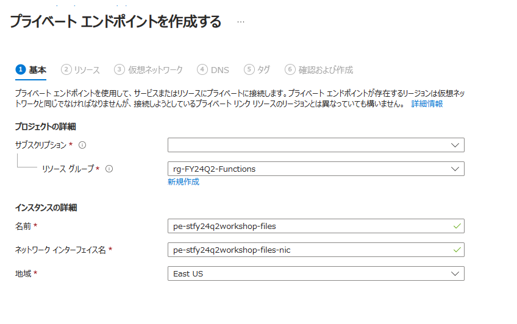

  - **リソース**

    - **対象サブリソース**: file

      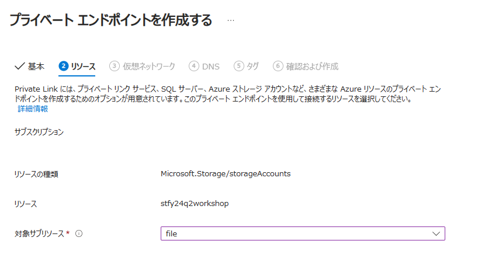

  - **仮想ネットワーク**

    - **ネットワーク**

      - **仮想ネットワーク**: 事前展開済みの仮想ネットワークを選択

      - **サブネット**: Subnet-2 (任意)

      - **プライベート エンドポイントのネットワーク ポリシー**: 無効

    - **プライベート IP 構成**

      - **IP アドレスを動的に割り当てる**: オン

      

      ※ アプリケーション セキュリティ グループはなし

  - **DNS**

    - **プライベート DNS ゾーンと統合する**: はい

      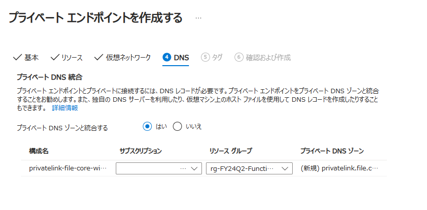

      ※ サブスクリプション、リソース グループはワークショップで使用中のものを選択

  - **タグ**

    - 既定のまま（なし）

      

  - **確認および作成** をクリックし、検証が成功したことを確認し **作成** をクリック

    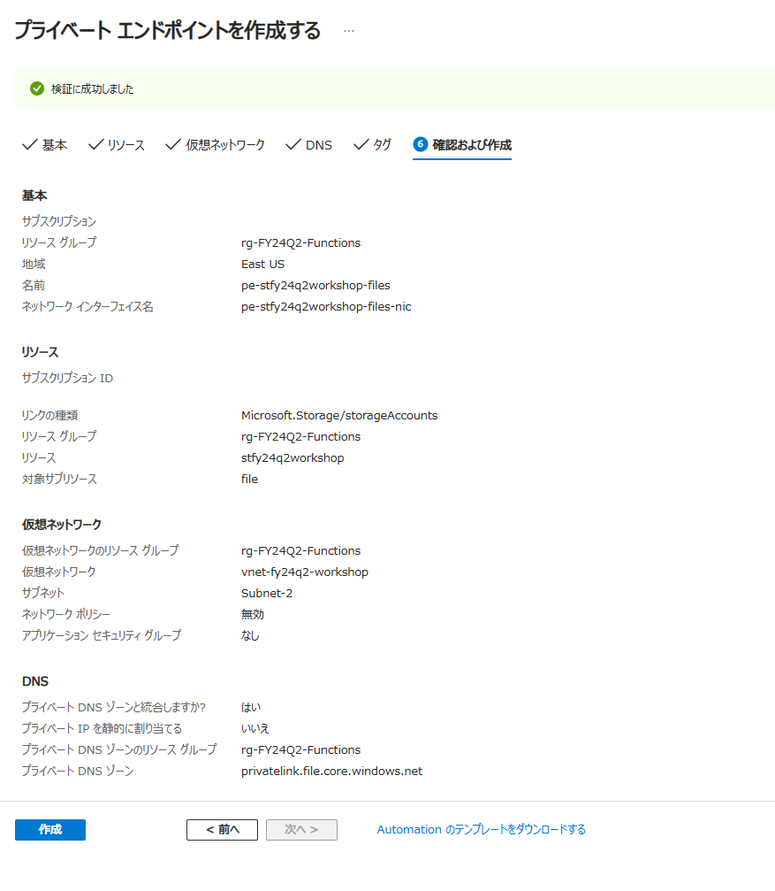

- ストレージ アカウントの管理ブレードで **アクセス キー** を選択

- key1 の接続文字列の **表示** をクリックし、接続文字列を表示した後、コピー

  ※ 後の手順で使用するため、メモ帳などのテキスト エディターに貼り付け

<br />

### Task 5: Azure Functions のネットワーク構成 (送信)

- Azure Functions の管理ブレードへ移動、**ネットワーク** を選択

- **送信トラフィック** の **VNET 統合** をクリック

  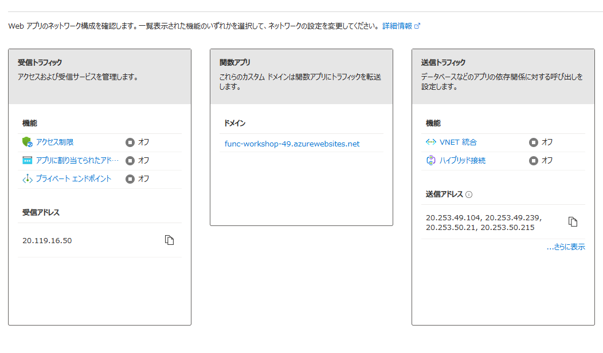

- **仮想ネットワーク統合の追加** をクリック

  

- 仮想ネットワーク統合の追加

  - **サブスクリプション**: ワークショップで使用中のサブスクリプション

  - **仮想ネットワーク**: 事前展開済みの仮想ネットワークを選択

  - **サブネット**: Subnet-3 (任意、未使用のサブネットを選択)

    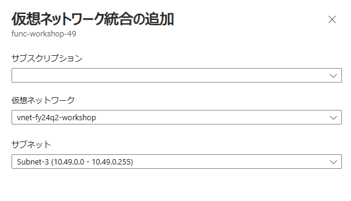

- **接続** をクリックし、仮想ネットワーク統合を追加

  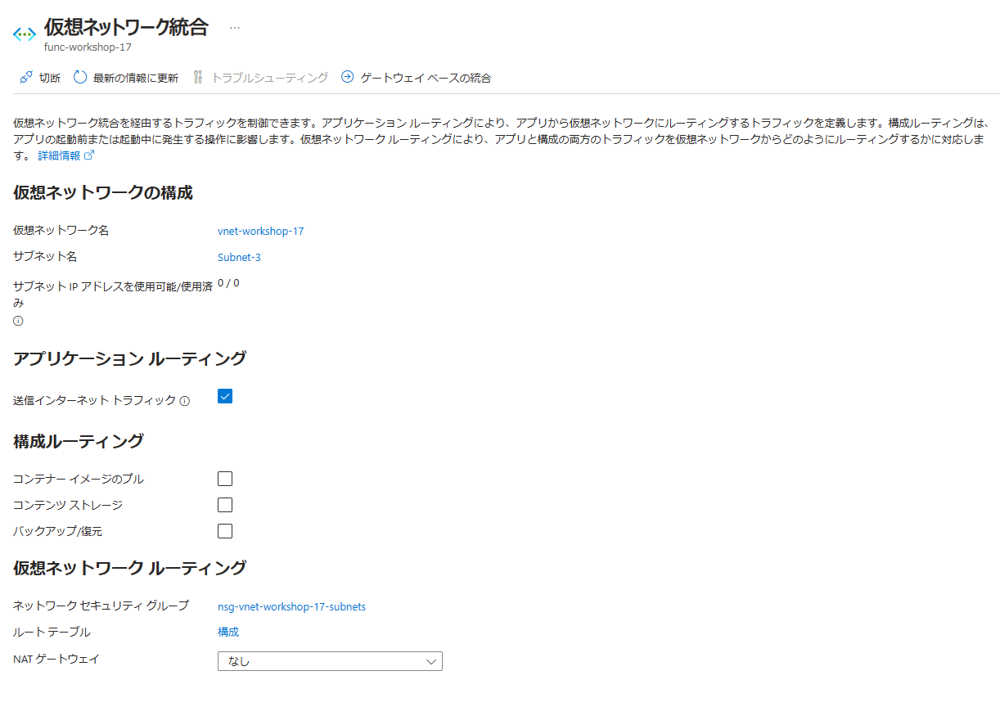

- **VNET 統合** が **オン** に変更されたことを確認

  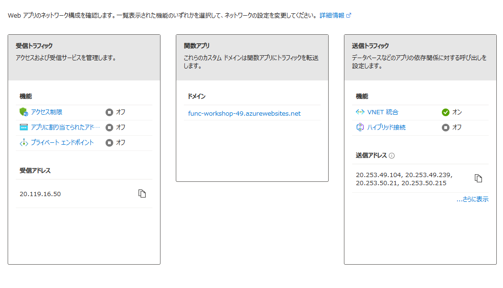

- Azure Functions の管理ブレードで **構成** を選択

- **AzureWebJobsStorage** をクリック

  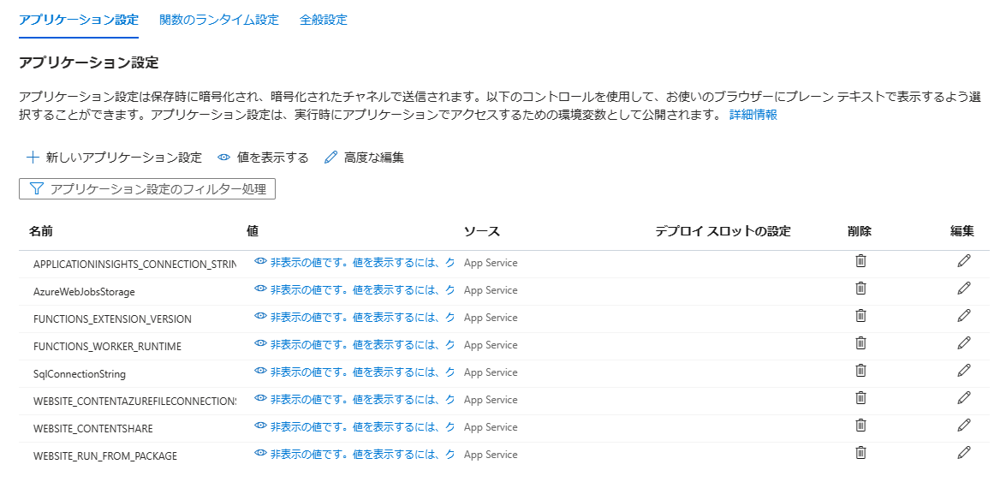

- **値** をコピーした新しいストレージ アカウントの接続文字列へ変更

  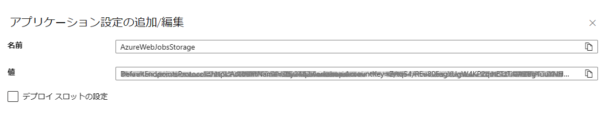

- 同様の手順で **WEBSITE_CONTENTAZUREFILECONNECTIONSTRING** の値を変更

  

- **＋ 新しいアプリケーション設定** をクリック

  - **名前**: WEBSITE_CONTENTOVERVNET

  - **値**: 1

  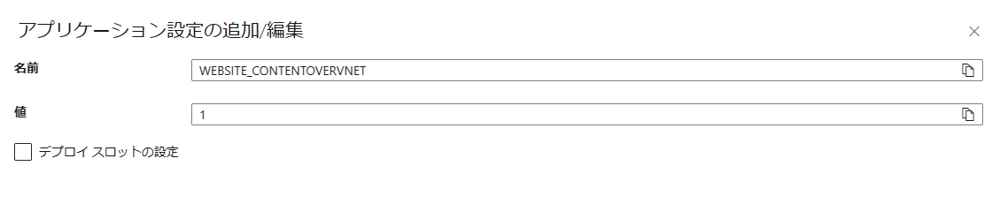

- **OK** をクリックし、新しいアプリケーション設定を追加

- **保存** をクリック、**変更の保存** の確認メッセージが表示されるので **続行** をクリック

  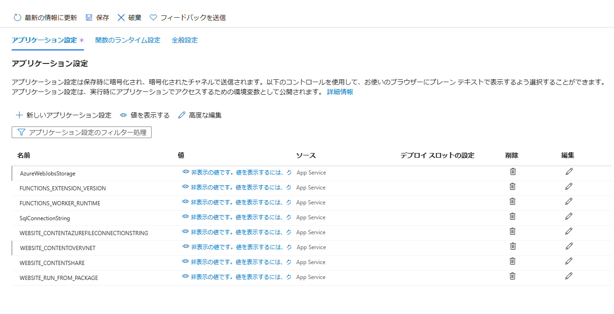

<br />

### Task 5: 関数アプリの実行

- **概要** を選択、関数に表示される **GetProduct** をクリック

  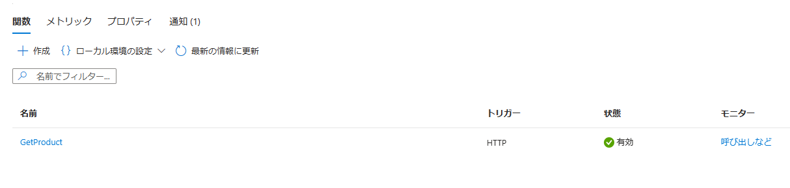

- **関数 URL の取得** をクリック、表示される URL をコピー

  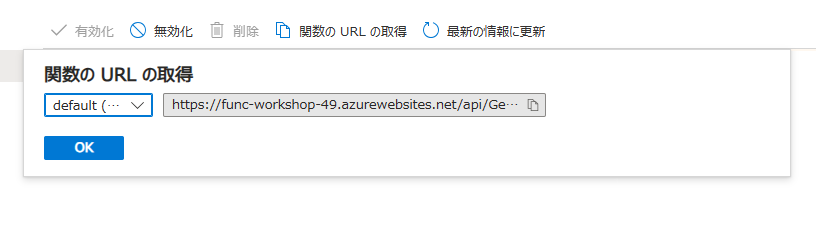

- Web ブラウザーを起動し、アドレス バーに関数アプリの展開時に出力された URL を貼り付け

- ?id=xx (xx は数字、5, 7, 10, 22, 27, 35 の間で指定) を付与して実行

  

  ※ 仮想ネットワーク統合によりプライベート通信で SQL Database よりレコードが取得できることを確認

<br />

### Task 6: Azure Functions のネットワーク構成 (受信)

- Azure Functions の管理ブレードへ移動、**ネットワーク** を選択

- **受信トラフィック** の **プライベート エンドポイント** をクリック

  

- **＋ 追加** ‐ **Advanced** をクリック

  

- プライベート エンドポイントを作成する

  - **基本**

    - **プロジェクトの詳細**

      - **サブスクリプション**: ワークショップで使用中のサブスクリプション

      - **リソース グループ**: ワークショップで使用中のリソース グループ
    
    - **インスタンスの詳細**

      - **名前**: 任意 (2 ～ 64 文字、英数字、ピリオド、アンダースコア、ハイフン)

      - **ネットワーク インターフェイス名**: 任意 (2 ～ 64 文字、英数字、ピリオド、アンダースコア、ハイフンを使用可)

      - **地域**: リソース グループと同じ地域を選択

      

  - **リソース**

    - **対象サブリソース**: sites

      

  - **仮想ネットワーク**

    - **ネットワーク**

      - **仮想ネットワーク**: 事前展開済みの仮想ネットワークを選択

      - **サブネット**: Subnet-2 (任意)

      - **プライベート エンドポイントのネットワーク ポリシー**: 無効

    - **プライベート IP 構成**

      - **IP アドレスを動的に割り当てる**: オン

      

      ※ アプリケーション セキュリティ グループはなし

  - **DNS**

    - **プライベート DNS ゾーンと統合する**: はい

      

      ※ サブスクリプション、リソース グループはワークショップで使用中のものを選択

  - **タグ**

    - 既定のまま（なし）

      

  - **確認および作成** をクリックし、検証が成功したことを確認し **作成** をクリック

    

- Azure Functions の管理ブレードへ移動、**ネットワーク** を選択

- **受信トラフィック** の **アクセス制限** をクリック

  

- **パブリック アクセスを許可する** をオフに設定し **保存** をクリック

  

- **アクセス拒否の確認** メッセージが表示されるので **続行** をクリック

- 最終的な Azure Functions のネットワーク構成

  

<br />

### Task 7: 関数アプリの実行

- **概要** を選択、関数に表示される **GetProduct** をクリック

  

- **関数 URL の取得** をクリック、表示される URL をコピー

  

- Web ブラウザーを起動し、アドレス バーに関数アプリの展開時に出力された URL を貼り付け

- ?id=xx (xx は数字、5, 7, 10, 22, 27, 35 のいずれかを指定) を付与して実行

  

  ※ インターネットを介したアクセスが拒否されることを確認

  

<br />

## Exercise 3: Key Vault 参照の利用

### Task 1: マネージド ID の有効化

- Azure Functions の管理ブレードで、**ID** を選択

- **システム割り当て済み** タブで **状態** を **オン** に設定し **保存** をクリック

  

- **システム割り当てマネージド ID を有効化する** のメッセージが表示されるので **はい** をクリック

- システム割り当て済みマネージド ID が有効化されたことを確認

  

<br />

### Task 2: Key Vault へのアクセス権の付与

- Key Vault の管理ブレードへ移動、**アクセス制御 (IAM)** を選択

- **＋ 追加** ‐ **ロールの割り当ての追加** を選択

  

- **キー コンテナー シークレット ユーザー** を選択し **次へ** をクリック

  

- **アクセス権の割当先** で **マネージド ID** を選択、**＋ メンバーを選択する** をクリック

- **マネージド ID** で **関数アプリ** を選択、表示される関数アプリをクリックし **選択** をクリック

  

- メンバーに関数アプリが追加されることを確認、**レビューと割り当て** をクリック

  

- **レビューと割り当て** をクリック

  

<br />

### Task 3: シークレットの登録

- Key Vault の管理ブレードで **シークレット** を選択

- **＋ 生成/インポート** をクリック

  

- シークレットの作成

  - **アップロード オプション**: 手動

  - **名前**: SqlConnectionString

  - **シークレット値**: データベースへの接続文字列

    

- **作成** をクリックし、シークレットを作成

- シークレットが正常に作成されたことを確認

  

<br />

### Task 4: Key Vault のネットワーク構成

- Key Vault の管理ブレードで **ネットワーク** を選択

- **ファイアウォールと仮想ネットワーク** でパブリック ネットワーク アクセスを設定

  - **許可するアクセス元**: パブリック アクセスの無効化

  ‐ **信頼された Microsoft サービスがこのファイアウォールをバイパスすることを許可する**: オフ

- **適用** をクリックし、指定した設定を適用

- **プライベート エンドポイント接続** を選択、**＋ 作成** をクリック

  

- プライベート エンドポイントを作成する

  - **基本**

    - **プロジェクトの詳細**

      - **サブスクリプション**: ワークショップで使用中のサブスクリプション

      - **リソース グループ**: ワークショップで使用中のリソース グループ
    
    - **インスタンスの詳細**

      - **名前**: 任意 (2 ～ 64 文字、英数字、ピリオド、アンダースコア、ハイフン)

      - **ネットワーク インターフェイス名**: 任意 (2 ～ 64 文字、英数字、ピリオド、アンダースコア、ハイフンを使用可)

      - **地域**: リソース グループと同じ地域を選択

      

  - **リソース**

    - **接続方法**: マイ ディレクトリ内の Azure リソースに接続します

    - **サブスクリプション**: ワークショップで使用中のサブスクリプション

    - **リソースの種類**: Microsoft.KeyVault/vaults

    - **リソース**: 事前作成済みの Key Vault

    - **対象サブリソース**: vaults

      

  - **仮想ネットワーク**

    - **ネットワーク**

      - **仮想ネットワーク**: 事前展開済みの仮想ネットワークを選択

      - **サブネット**: Subnet-2 (任意)

      - **プライベート エンドポイントのネットワーク ポリシー**: 無効

    - **プライベート IP 構成**

      - **IP アドレスを動的に割り当てる**: オン

      

      ※ アプリケーション セキュリティ グループはなし

  - **DNS**

    - **プライベート DNS ゾーンと統合する**: はい

      

      ※ サブスクリプション、リソース グループはワークショップで使用中のものを選択

  - **タグ**

    - 既定のまま（なし）

      

  - **確認および作成** をクリックし、検証が成功したことを確認し **作成** をクリック

    

<br />

### Task 5: Azure Functions の構成

- Azure Functions の管理ブレードで **構成** を選択

- **SqlConnectionString** をクリック、値を Key Vault 参照に変更

  ```
  @Microsoft.KeyVault(VaultName={Key Vault 名};SecretName=SqlConnectionString)
  ```

  ※ {Key Vault 名} をシークレットを登録した Key Vault の名前に変更

  

- **保存** をクリックし、変更を適用

  

- **ソース** 列の **キー コンテナーの参照** のアイコンがグリーンで正常を示すことを確認

  

<br />

## Exercise 4: API Management による API の公開

### Task 1: 関数アプリのインポート

- Azure ポータルで API Management の管理ブレードを表示

- **API** を選択、**＋ Add API** ‐ **Function App** をクリック

  

- **Browse** をクリック

  

- Azure Functions のインポートの必要な設定の構成で **選択** をクリック

  

- Azure 関数アプリを選択画面でインポートする関数アプリを選択し、**選択** をクリック

  

- **選択** をクリックし、関数アプリをインポート

  

- Create fron Function App 画面を **Full** に変更

- **API URL suffix** を **api** に変更、**Products** に **Unlimited** を追加し、**Create** をクリック

  

- API が追加されたことを確認

  

- **Test** タブを選択

- **GetProduct** を選択、**Query parameters** の **Add parameter** をクリック

  - **NAME**: id

  - **VAULE**: 5, 7, 10, 22, 27, 35 のいずれかを指定

- **Send** をクリックし、テストを実行

  

- 関数アプリが実行され、応答が返ってくることを確認

  

<br />

### Task 2: 製品の作成と発行

- API Management の管理ブレードへ移動、**製品** を選択

- **＋ 追加** をクリック

  

- 製品の追加

  - **表示名**: Cloud Workshop (任意)

  - **ID**: cloud-workshop (任意、表示名から自動生成)

  - **説明**: Subscribes will be able to run 1 call/minutes up to a maximum of 100 calls/week.

  - **発行済み**: オン

  - **サブスクリプションを要求する**: オフ

    
  
- **作成** をクリックして、製品を作成

<br />

### Task 3: 製品の構成

- 作成した製品をクリック

  

- **API** を選択し、**＋ 追加** をクリック

  

- API 画面で追加する API にチェックを付け、**選択** をクリック

  

- 選択した API が追加

  

- **ポリシー** を選択、**Inbound processing** の **</>** をクリック

  

- **Inbound** にレート制限とクォータのポリシーを追加

  ```
          <rate-limit calls="1" renewal-period="60" />
          <quota calls="100" renewal-period="604800" />
  ```

- **Save** をクリックし、変更を保存

  

- **アクセス制御** を選択、**＋ グループの追加** をクリック

  

- グループ画面で **Guests** にチェックを付け、**選択** をクリック

  

- Guests が追加

  

<br />

### Task 4: 関数アプリの実行

- **概要** を選択、関数に表示される **ゲートウェイの URL** をコピー

  

- Web ブラウザーを起動し、アドレス バーに関数アプリの展開時に出力された URL を貼り付け

- /api/GetProduct?id=xx (xx は数字、5, 7, 10, 22, 27, 35 のいずれかを指定) を付与して実行

  

- 続けて実行すると、レート制限が適用され、状態コード 429 で応答

  

- **サブスクリプション** を選択、スコープが **製品: Unlimited** の **・・・** をクリックし、**キーの表示/非表示** を選択

  

- 主キーをコピー

  

  ※ 後の手順で使用するため、メモ帳などのテキスト エディターに貼り付け

- Windows PowerShell を起動

  ```
  curl.exe -i -X GET {ゲートウェイ URL}/api/GetProduct?id=35 -H "Ocp-Apim-Subscription-Key: {サブスクリプション キー}"
  ```

  ※ {ゲートウェイ URL} を API Management のゲートウェイ URL に変更

  ※ {サブスクリプション キー} をコピーしたサブスクリプション キーに変更

- レート制限のポリシーが適用されず、連続で実行されることを確認

  

<br />

### Task 5: API Management の診断設定

- Azure ポータルで API Management の管理ブレードへ移動

- **診断設定** を選択、**＋ 診断設定を追加する** をクリック

  

- 診断設定

  - **診断設定の名前**: 任意

  - **ログ**

    - **カテゴリ グループ**

      - **audit**: オン

      - **allLogs**: オン
  
  - **メトリック**

    - **AllMetrics**: オン

  - **宛先の詳細**

    - **Log Analytics ワークスペースへの送信**: オン

      - **サブスクリプション**: ワークショップで使用中のサブスクリプション

      - **Log Analytics ワークスペース**: 事前展開済みの Log Analytics ワークスペース

      - **ターゲット テーブル**: リソース固有

    

- **保存** をクリックして、診断設定を有効化

- **API** を選択

- 診断設定を行う API を選択し、**Settings** タブを選択し **Azure Monitor** を選択

  

- Diagnostics Logs

  - **Override global**: オン

  - **Sampling (%)**: 100

  - **Always log errors**: オン

  - **Log client IP address**: オン

  - **Verbosity**: Information

  - **Additional settings**

    - **Number of payload bytes**: 8192

    

- **Save** をクリックし、設定を保存

<br />

## Exercise 5: API のバージョン管理

### Task 1: 新しいバージョンの追加と構成

- Azure ポータルで API Management の管理ブレードへ移動、**API** を選択

- API 名の右に表示される **・・・** を右クリックし、**Add version** をクリック

  

- Create a new API as a version

  - **Version identifier**: v2

  - **Versioning scheme**: Path

  - **Full API version name**: 関数アプリ名-v2

  - **Products**: Cloud Workshop, Unlimited

    
  
- **Create** をクリックし、バージョンを追加

- 追加したバージョン (v2) の関数名 (GetProduct) を選択、Outbound processing の **</>** をクリック

  

- **outbound** に JSON から XML へ変換を行うポリシーを追加

  ```
          <json-to-xml apply="always" consider-accept-header="false" />
  ```

- **Save** をクリックして変更を保存

  

<br />

### Task 2: 関数アプリの実行

- **概要** を選択、関数に表示される **ゲートウェイの URL** をコピー

  

- Web ブラウザーを起動し、アドレス バーに関数アプリの展開時に出力された URL を貼り付け

- /api/GetProduct?id=xx (xx は数字、5, 7, 10, 22, 27, 35 のいずれかを指定) を付与して実行

  

  ※ JSON 形式でデータが返されることを確認

- {ゲートウェイの URL}/api/v2/GetProduct?id=xx (xx は数字、5, 7, 10, 22, 27, 35 のいずれかを指定) を実行

  

  ※ XML 形式でデータが返されることを確認

  ※ レート制限が適用されているため１分以上間隔をあけて実行

<br />

### Task 3: ログの確認

- API Management の管理ブレードで **ログ** を選択

- クエリを記述し **実行** をクリック

  ```
  ApiManagementGatewayLogs 
  | where TimeGenerated > ago(1h) 
  | sort by TimeGenerated asc
  ```

  

- ログを確認

  

  ※ API を呼び出してからログに反映されるまで 2, 3 分かかります
