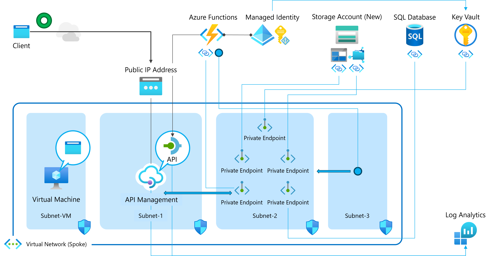

# Serverless-Computing-using-Azure-Functions

 

### Exercise 1 - 5:

 

### Exercise 6 - 9:

 

### ディレクトリ構成

┣ src  
┃   ┣ CS (C# アプリのソース コード)  
┃   ┃   ┣ Api1   
┃   ┃   ┗ Api2  
┃   ┗ Python (Python アプリのソース コード)  
┃   ┃   ┣ Api1   
┃   ┃   ┗ Api2  
┣ templates (ARM テンプレート)  
┣ Before the HOL.md (事前準備)  
┣ HOL step-by-step Guide.md (ハンズオン手順書)  
┣ HOL step-by-step Guide-2.md (ハンズオン手順書)  
┗ README.md  